<div STYLE="page-break-after: always;"></div>


$$\Huge \textbf{Contributor}$$

------------------------------

> Update: 2024/02/20 23:56

（按贡献时间先后顺序排序）

叶睿聪（dgsyrc@github）、刘明楷（milchstrasse565@github）、洪佳、杜雨蒙、邱万理、程英杰、胡彦祺

<div STYLE="page-break-after: always;"></div>

$$\Huge \textbf{目录}$$

------------------


[TOC]

<div STYLE="page-break-after: always;"></div>

## 1 硬件

> Contributors: 叶睿聪 (dgsyrc@github)

### 1.1 分电板


黄色接头为XT60母头，分电板上有四个XT30公头，四个2Pin母头（白色方形），一个8Pin母头

### 1.2 电池架


黄色接头为XT60公头（接分电板XT60母头）

### 1.3 DC-DC（24V-19V）变压器


黄色接头为XT30母头（接分电板XT30公头），黑色为DC（接迷你PC电源）

### 1.4 电池


圆形按钮为开关，短按一次再长按打开（关闭同理）

### 1.5 迷你PC（以NUC 11为例）


#### 1.5.1 参数

| 属性                | 参数                 |
| ------------------- | -------------------- |
| CPU                 | Intel Core i5-1135G7 |
| GPU                 | 集显 Intel Xe        |
| RAM                 | 16G DDR4             |
| 硬盘                | PCIe4.0 Nvme 512G    |
| 无线网卡            | 有                   |
| USB 3.1 接口        | 3个                  |
| 雷电3接口（Type-C） | 2个                  |

#### 1.5.2 各种接口/硬件位置


### 1.6 工业相机

#### 1.6.1 参数

制造商：迈德威视（MindVision）

型号：MV-SUA134GC-T

镜头：6mm焦距 F2.0光圈 1/1.8″靶面

#### 1.6.2 接口


### 1.7 各种线缆

#### 1.7.1 USB-Camera


#### 1.7.2 网线


#### 1.7.3 HDMI-HDMI


### 1.8 USB to TTL


#### 1.8.1 接口

| 接口 | 用法          |
| ---- | ------------- |
| VCC  | 5V            |
| TXD  | 接另一端的RXD |
| RXD  | 接另一端的TXD |
| GND  | 接GND（地线） |

### 1.9 手持装甲板调试模块


#### 1.9.1 参数

| 颜色 | 状态 |
| ---- | ---- |
| 红色 | 红方 |
| 蓝色 | 蓝方 |
| 紫色 | 离线 |

### 1.10 外置MiniPC完整装机展示


<div STYLE="page-break-after: always;"></div>

## 2 环境配置

### 2.1 双系统安装

> Contributors: 叶睿聪 (dgsyrc@github)

#### 2.1.1 空间预留

方法一：如果电脑有多的硬盘插槽，可以直接买新的固态硬盘装上电脑直接跳过本步骤，硬盘的安装可以自己搜（过程很简单），怕弄坏可以拿硬盘找官方保修点装

方法二：直接将某个盘下的文件全部移动到另一个盘，如果该盘下装有软件，请先卸载再安装到另一个盘

盘的容量不一定要200G左右，可以比这个大，后面多的空间可以单独再分出来存东西


右键，此电脑->管理


进入存储->磁盘管理，右键删除刚才清理出来的盘


删完后会变成这样


其它方法：例如用Diskgenius等工具的方法这里就不细讲，方法很多，只要能不丢失原有数据分出空闲分区即可

#### 2.1.2 系统安装盘

[Ventoy（用于制作安装系统的启动盘）](https://www.ventoy.net/cn/download.html)

插U盘

要求：一个8G以上的协议至少为**USB3.0**的U盘（不能用SD卡，后面安装大概率装不上，USB3.0以上协议的特征是USB口是**蓝色**的），且U盘为空（后面需要格式化），如果没有U盘可以用移动硬盘（doge

解压下好的Ventoy，打开


选择你的U盘，点击安装


下载Ubuntu 22.04

[Ubuntu 22.04 的安装镜像文件（清华开源镜像站）](https://mirrors.tuna.tsinghua.edu.cn/ubuntu-releases/jammy/ubuntu-22.04.2-desktop-amd64.iso)

安装好后会看到电脑里有个叫 Ventoy 的盘，把下好的 Ubuntu 22.04 镜像放进去


如果不是这个文件，那大概率是下错了

接着下载这四个东西，都放进U盘

[VScode的Linux安装包](https://code.visualstudio.com/sha/download?build=stable&os=linux-deb-x64)

如果只是安装Ubuntu，下面三个请忽略（用来配置OpenCV的）

[OpenCV 4.5.5 的源码（Source Code）](https://github.com/opencv/opencv/releases)

[OpenCV_Contrib 4.5.5 的源码（Source Code）](https://github.com/opencv/opencv_contrib/tags)

**ippicv包**

```
链接：https://pan.baidu.com/s/1u3-AbMBMqXeElnz76bHivw 
提取码：rm24 
```

#### 2.1.3 Ubuntu安装

重启电脑，但不要进windows

这里需要自己查询自己的电脑开机时按哪个键更改启动盘，或者进BIOS更改启动顺序

常见的有 `F2` `F9` `F12`

如果键盘上的这些键是小字，功能图标是大字，那在按的的时候要跟 `Fn` 一起按

然后选择带USB的那个启动（假如提示无法通过该盘启动，可能是没关安全启动，需要到BIOS里面关掉）

进入下图后回车即可


选择第一个然后回车


等待进入Ubuntu的安装界面

如果在这一步出现白字刷屏报错，显示Live CD启动失败及无法打开某个block则需要换个U盘做启动盘（一般是因为U盘不是USB3.0或者使用存储卡+读卡器安装）

别的错误baidu解决（

进入Ubuntu安装界面，点击Install


语言选**English**，因为中文下自动生成的中文路径在后面使用过程中容易出问题


连接wifi，后面需要联网自动安装驱动（不要使用需要网页登录的wifi，如学校的，这里没法登录）


把 `Install third-party` 勾上，这个是自动安装驱动


这一步很**重要**，别选错了，选错你的电脑数据就没了

选择 `Something else`


接着找到前面步骤中预留的空间（显示 `free space` 字样的）


点击 `+` 

先新建 `swap` 分区

空间按 16G = 16384MB 分

选择逻辑分区

下面 `Use as` 选择 `swap area`


确定后再新建 `boot` 分区

空间分 4G=4096MB

选择逻辑分区

下面 `Use as` 选择 ` Ext4 journaling file system`

 `Mount Point` 选择 `/boot`


确定后再新建 `/` 分区

空间分 100G = 102400MB（如空间不足，分配40G左右也可）

选择逻辑分区

下面 `Use as` 选择 ` Ext4 journaling file system`

 `Mount Point` 选择 `/`

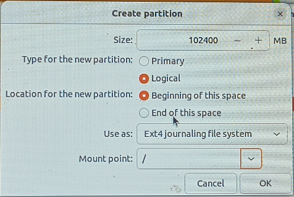

确定后再新建 `/home` 分区

空间按需即可，如果是前面单独分出来的空间，直接把剩下的部分都分到这个分区（推荐最少40G）

选择主分区

下面 `Use as` 选择 ` Ext4 journaling file system`

 `Mount Point` 选择 `/home`


下面的 `Device for boot loader installation` 选择 `/boot` 所在的 `Device`


接着点 `Install Now`

位置选 `Shanghai`，这个是用来确定时区的


下一步要填写用户名与密码，如果不想每次登录输密码把 `Log in automatically` 选上

等待安装完成即可，可能比较慢，取决于网络环境


安装完成后会提示重启，后面还会提示拔U盘，拔掉U盘回车即可

如果没重启，手动开机就行

开机的时候会进去Grub界面，可以通过键盘上下键更改选择（如果没得选择，仅显示grub命令行界面，请参看2.1.4部分）

在 `Ubuntu` 那一行回车进入 `Ubuntu`

在 `Windows Boot Manager` 那一行回车进入 `Windows`

#### 2.1.4 常见问题

**① U盘安装时进不去Ubuntu安装界面，卡在黑屏白字页，内容显示某个block error且刷屏**

**触发原因：**U盘问题

**解决方式：**换个U盘，请保证U盘为USB3.0以上（蓝色插头），换了就行

**②Ubuntu安装好后重启卡在Grub命令行界面，找不到选项进入Ubuntu和Windows Boot Manager**

> 参考文献：
>
> [4] [重装Ubuntu后开机停在Grub命令行的解决办法_ubuntu开机卡在命令行-CSDN博客 - https://blog.csdn.net/](https://blog.csdn.net/weixin_44481159/article/details/109240338)


**触发原因：**未知

**解决方式：**

依次输入如下命令

先查看硬盘信息

```
ls
```

寻找boot分区

```
ls (hd0,gptX)/
```

注意上面的 `hd0,gptX` 为前面查看硬盘分区信息时列出的编号，一个个查即可，如果此时列出的的文件信息包含grub文件夹，那么这个编号对应的就是boot分区

接着是关联grub（以 `hd0,gpt5` 为例）

依次输入这三行命令

```
set root=(hd0,gpt5)
set prefix=(hd0,gpt5)/grub
normal
```

输完后即可进入grub的引导选择页面，直接进Ubuntu

进入Ubuntu后，打开终端，先更新grub

```
sudo update-grub
```

接着下载别人做好的修复工具（记得联网）

```
sudo add-apt-repository ppa:yannubuntu/boot-repair && sudo apt-get update
sudo apt-get install -y boot-repair && boot-repair
```

接着修复工具会自动启动，修复方式选择推荐修复（recommend），期间会要求你复制它显示的一些命令到终端，新开一个终端复制进去执行即可

还有Yes/No的选择页面，都选Yes就行

按工具提示执行完所有步骤后，重启就能够自动进入grub的启动选择页面了

### 2.2 OpenCV

> Contributors: 叶睿聪 (dgsyrc@github)

*方法适用于Ubuntu 20.04/22.04 以及WSL中的Ubuntu 20.04/22.04*

#### 2.2.1 安装步骤

进入Ubuntu，把U盘里面当时拷进去的三个包复制到桌面

先安装一些环境依赖

在桌面右键打开终端 `Terminal`

依次执行以下指令

```
sudo apt-get install build-essential
sudo apt-get install cmake git libgtk2.0-dev pkg-config libavcodec-dev libavformat-dev libswscale-dev
sudo apt install -y wget unzip
sudo apt install -y make
sudo apt update
```

`sudo` 指令需要输入前面设置的密码

如果提示[Y/n]，输入 Y 回车即可

将OpenCV 4.5.5源码包解压到桌面，并把OpenCV_Contrib解压到OpenCV 4.5.5所在的文件夹内

即下图：


在上面这个文件夹内右键打开终端 `Terminal`

输入 `mkdir build` 新建 `build` 文件夹

输入 `cd build` 打开 `build` 文件夹

然后输入以下指令

```
cmake ..
```

注意，执行 `cmake ..` 时可能会提示ippicv库/ade库的文件下载失败（向上检查一遍刚才终端的输出信息【黄色字体】，这个错误不会在输出信息末尾提示），详细报错和解决方式见 `2.2.2 常见问题`

若没有报错，继续执行以下指令

```
sudo make -j2
sudo make install
```

其中第一个指令的执行时间较长，这是因为在编译OpenCV库

安装完成后，在终端中打开`opencv-4.5.5/sample/cpp/example_cmake`

新建文件夹 `build`，在终端打开后执行：

```
make -j8
./opencv_example
```

若出现 `Hello OpenCV` 则说明配置成功

#### 2.2.2 常见问题

- 提示ippicv库下载失败

  **报错信息：**

  报错信息类似下一个错误（ade库下载失败）

  **解决方案：**

  提前下好这个包

  备用链接：https://pan.baidu.com/s/1oxF0PY8Jhhr9jZ1f6xqTQg 提取码：rm24 

  此时需要提前准备好这个包并放在桌面: `ippicv_2020_lnx_intel64_20191018_general.tgz`

  重新在opencv-4.5.5文件夹内开启终端（在文件夹内右键选择`Terminal`)

  输入

  ```3
  gedit ./3rdparty/ippicv/ippicv.cmake
  ```

  此时会打开文本编辑器

  

  前文提到将 `ippicv_2020_lnx_intel64_20191018_general.tgz` 放在了桌面，故将框出的这行改为桌面的目录（原本是一个网址）

  【注意：上图的路径地址仅为示例，放在桌面的路径以下面为准】

  ```
  file:///home/你的用户名/Desktop/
  ```

  然后再次执行以下命令即可

  ```
  cmake ..
  ```

- 提示ade库下载失败

  **报错信息：**

  

  **解决方案：**

  提前下载好这个ade包：

  官方链接：https://github.com/opencv/ade/archive/v0.1.1f.zip

  备用链接：https://pan.baidu.com/s/1PUOKD5rw2v2qqG1GuCBqxQ 提取码：rm24

  下好之后放在桌面，注意如果是官方链接下载的需要重新命名这个包为下面这个名字

  

  打开`opencv-4.5.5/modules/gapi/cmake/DownloadADE.cmake`

  

  将github那行的链接改为（保留引号）

  ```
  file:///home/你的用户名/Desktop/
  ```

  然后再次执行以下命令即可

  ```
  cmake ..
  ```
  
- opencv_contrib编译失败

  >Contributors: 胡彦祺

  WSL下使用make命令编译发生冲突

  

  opencv_crontrib中的插件无法编译，检查$PATH发现存在大量Windows系统下共享的环境变量

  

  关闭该功能，修改文件`/etc/wsl.conf`
  
  ```bash
  sudo vim /etc/wsl.conf
  ```
  
  ```ini
  # 不加载Windows中的PATH内容
  [interop]
  appendWindowsPath = false
  
  # 不自动挂载Windows系统所有磁盘分区
  [automount]
  enabled = false
  ```

  退出WSL，并重启该容器。*注：退出后必须重启，否则修改不会生效*
  
  ```bash
  wsl --list #查看WSL列表
  ```
  
  ```bash
  wsl --terminate Ubuntu-18.04 #改为你自己WSL的名字
  ```
  
  重新cmake、make编译即可

### 2.3 VSCode

> Contributors: 叶睿聪 (dgsyrc@github)

#### 2.3.1 安装

##### 2.3.1.1 Ubuntu

下载好的 VScode 的.deb安装包放到桌面

在桌面打开终端，输入以下指令

```
sudo dpkg -i 你的安装包名字.deb 
```

安装包名字可以右键安装包重命名 `Rename`  , `Ctrl + C` 复制，在终端中 `Ctrl + Shift + V` 粘贴

安装完成后在终端输入以下指令回车执行

```
code
```

即可打开VSCode

##### 2.3.1.2 Windows

下载安装即可

[Visual Studio Code - Code Editing. Redefined - https://code.visualstudio.com/](https://code.visualstudio.com/)

#### 2.3.2 语言包配置

打开VScode

点击


进入插件安装页面

在搜索栏上输入 `Chinese` 安装这个语言包


#### 2.3.3 OpenCV环境配置

安装这四个包即可


#### 2.3.4 Tensorflow


打开扩展管理

安装以下扩展包


安装完成后，在左侧菜单打开远程资源管理器


选择你装好环境的WSL


选择打开文件夹，此时会提示要打开的目录，推荐 `/home/用户名` （用户名为前面设置的username）


安装这两个扩展，注意是安装在WSL内，即点击这种按钮


**例程训练**

> 参考文献：
>
> [2] [人工智能实践：Tensorflow笔记\_北京大学\_中国大学MOOC(慕课) - https://www.icourse163.org/](https://www.icourse163.org/course/PKU-1002536002)

下载如下代码包：

```
链接：https://pan.baidu.com/s/127QAuHTod9f96L9bLb1dgw 
提取码：rm24 
```

将文件在windows下解压后，将整个class5文件夹拖进vscode的资源管理器中，即


打开 `class5/CIFAR10_CNN/p46_cifar10_resnet18.py` 


此时会提示找不到tensorflow库的位置，鼠标移到标黄线处选择快速修复


选择选择其他解释器


选择 `Python 3.9.18('tf')`

由于版本的问题，此时代码依然会报错，修改以下代码

```
import tensorflow as tf
import os
import numpy as np
from matplotlib import pyplot as plt
from tensorflow.keras.layers import Conv2D, BatchNormalization, Activation, MaxPool2D, Dropout, Flatten, Dense
from tensorflow.keras import Model
```

为

```
import tensorflow as tf
import os
import numpy as np
from matplotlib import pyplot as plt
from tensorflow.python.keras.layers import Conv2D, Activation, MaxPool2D, Dropout, Flatten, Dense
from tensorflow.python.keras import Model
from keras.layers import BatchNormalization
```

点击VSCode右上角的运行按钮

训练模型（第一次跑时会先自动下载训练数据）


注意，训练完成后需要等待一段时间才会显示图表

跑出该图即可（不一定一样）


尝试修改代码中的参数使得 Validation Accuracy 达到0.9以上

### 2.4 ROS

> Contributors: 刘明楷（milchstrasse565@github）

####  2.4.1 创建工作空间

终端输入

`mkdir -p ~/test_ws/src`

一般工作空间名为xxx_ws，ws也可写在前面，看个人习惯

#### 2.4.2 创建功能包

进入工作空间的src目录

`cd ~/test_ws/src`

创建功能包

`catkin_create_pkg hello_test std_msgs roscpp rospy`

#### 2.4.3 创建ros节点程序

进入hello_test包的src目录写helloworld程序：


```cpp
#include "ros/ros.h"

int main(int argc, char *argv[])
{
    //执行 ros 节点初始化
    ros::init(argc,argv,"hello");
    //创建 ros 节点句柄(非必须)
    ros::NodeHandle n;
    //控制台输出 hello world
    ROS_INFO("hello world!");

    return 0;
}
```

进入hello_test功能包目录下的CMakeLists.txt,一般只修改以下两项即可：

`add_executable(${PROJECT_NAME} src/hello.cpp)
target_link_libraries(${PROJECT_NAME}  ${catkin_LIBRARIES})`

add_executable生成的可执行文件名一般就是包名，即${PROJECT_NAME}，也就是hello_test ，如果有多个节点，则定义为其他名字

然后target_link_libraries，将可执行文件连接到库

最后进入到工作空间目录下编译即可：

`cd ~/test_ws`

 ` catkin_make`

每次编译后，都要配置好环境变量：

`source ~/test_ws/devel/setup.bash`

也可在将这句话加在.bashrc文件中，就不用每次配置环境变量了

然后在终端启动ros：

`roscore`

`rosrun hello_test hello_test `

rosrun后面跟包名+可执行文件名


#### 2.4.4 创建发布者

创建新的节点test_pub.cpp：  

```cpp
/*
    需求: 实现基本的话题通信，一方发布数据，一方接收数据，
         实现的关键点:
         1.发送方
         2.接收方
         3.数据(此处为普通文本)

         PS: 二者需要设置相同的话题


    消息发布方:
        循环发布信息:HelloWorld 后缀数字编号

    实现流程:
        1.包含头文件 
        2.初始化 ROS 节点:命名(唯一)
        3.实例化 ROS 句柄
        4.实例化 发布者 对象
        5.组织被发布的数据，并编写逻辑发布数据

*/
// 1.包含头文件 
#include "ros/ros.h"
#include "std_msgs/String.h" //普通文本类型的消息
#include <sstream>

int main(int argc, char  *argv[])
{   
    //设置编码
    setlocale(LC_ALL,"");

    //2.初始化 ROS 节点:命名(唯一)
    // 参数1和参数2 后期为节点传值会使用
    // 参数3 是节点名称，是一个标识符，需要保证运行后，在 ROS 网络拓扑中唯一
    ros::init(argc,argv,"talker");
    //3.实例化 ROS 句柄
    ros::NodeHandle nh;//该类封装了 ROS 中的一些常用功能

    //4.实例化 发布者 对象
    //泛型: 发布的消息类型
    //参数1: 要发布到的话题
    //参数2: 队列中最大保存的消息数，超出此阀值时，先进的先销毁(时间早的先销毁)
    ros::Publisher pub = nh.advertise<std_msgs::String>("chatter",10);

    //5.组织被发布的数据，并编写逻辑发布数据
    //数据(动态组织)
    std_msgs::String msg;
    // msg.data = "你好啊！！！";
    std::string msg_front = "Hello 你好！"; //消息前缀
    int count = 0; //消息计数器

    //逻辑(一秒10次)
    ros::Rate loop_rate(10);

    //节点不死
    while (ros::ok())
    {
        //使用 stringstream 拼接字符串与编号
        std::stringstream ss;
        ss << msg_front << count;
        msg.data = ss.str();
        //发布消息
        pub.publish(msg);
        //加入调试，打印发送的消息
        ROS_INFO("发送的消息:%s",msg.data.c_str());

        //根据前面制定的发送贫频率自动休眠 休眠时间 = 1/频率；
        loop_rate.sleep();
        count++;//循环结束前，让 count 自增
    }
    return 0;
}
```

发送频率设置为10HZ

#### 2.4.5 创建订阅者

创建新的节点test_sub.cpp：  

```cpp
/*
    需求: 实现基本的话题通信，一方发布数据，一方接收数据，
         实现的关键点:
         1.发送方
         2.接收方
         3.数据(此处为普通文本)


    消息订阅方:
        订阅话题并打印接收到的消息

    实现流程:
        1.包含头文件 
        2.初始化 ROS 节点:命名(唯一)
        3.实例化 ROS 句柄
        4.实例化 订阅者 对象
        5.处理订阅的消息(回调函数)
        6.设置循环调用回调函数

*/
// 1.包含头文件 
#include "ros/ros.h"
#include "std_msgs/String.h"

void doMsg(const std_msgs::String::ConstPtr& msg_p){
    ROS_INFO("我听见:%s",msg_p->data.c_str());
    // ROS_INFO("我听见:%s",(*msg_p).data.c_str());
}
int main(int argc, char  *argv[])
{
    setlocale(LC_ALL,"");//
    //2.初始化 ROS 节点:命名(唯一)
    ros::init(argc,argv,"listener");
    //3.实例化 ROS 句柄
    ros::NodeHandle nh;

    //4.实例化 订阅者 对象
    ros::Subscriber sub = nh.subscribe<std_msgs::String>("chatter",10,doMsg);
    //5.处理订阅的消息(回调函数)
    ros::Rate loop_rate(5);//频率为５hz
    while (ros::ok())
    {
        ros::spinOnce();
        loop_rate.sleep(); //配合执行频率，sleep一段时间，然后进入下一个循环。
    }
    return 0;
}
```

回调函数名为doMsg，传入的参数为常量指针，因为有时候自定义消息类型数据量会比较大，另外注意这里配合spinOnce()实现接收频率的控制，如果是spin()函数，它就不会返回了，也不继续往后执行了，相当于它在自己的函数里面死循环了。

配置cmakelist文件：

在1.3的基础上添加：

```cmake
add_executable(${PROJECT_NAME} src/hello.cpp)
add_executable(test_pub
  src/test_pub.cpp
)
add_executable(test_sub
  src/test_sub.cpp
)
target_link_libraries(${PROJECT_NAME} ${catkin_LIBRARIES})
target_link_libraries(test_pub ${catkin_LIBRARIES})
target_link_libraries(test_sub ${catkin_LIBRARIES})
```

重新catkin_make编译后，source环境变量后在终端运行发送和接收节点

```
rosrun hello_test test_pub
rosrun hello_test test_sub
```

将分别看到：


#### 2.4.6 安装turtlebot3仿真需要其他的功能包 

```
sudo apt install ros-noetic-gazebo-ros-pkgs 
sudo apt install ros-noetic-gazebo-ros-control
sudo apt-get install ros-noetic-rviz
sudo apt-get install ros-noetic-map-server
sudo apt install ros-noetic-gmapping
sudo apt install ros-noetic-navigation
sudo apt install ros-noetic-move-base
```

#### 2.4.7 安装turtlebot3仿真和导航包

```
mkdir -p ~/catkin_turtlebot3/src
cd ~/catkin_turtlebot3/src
git clone https://github.com/ROBOTIS-GIT/turtlebot3.git
git clone https://github.com/ROBOTIS-GIT/turtlebot3_simulations.git
cd ..
catkin_make
```

添加模型申明，用以设定打开后模型的样子

`echo "export TURTLEBOT3_MODEL=waffle" >> ~/.bashrc`

对环境变量进行设置

`echo "source ~/catkin_turtlebot3/devel/setup.bash" >> ~/.bashrc`

#### 2.4.8 运行导航仿真例程

以上环境配置成功后，后续2.3和2.4的仿真例程运行可参考(https://blog.csdn.net/weixin_51015707/article/details/121522342)

 打开新终端，输入命令启动Gazabo，是通过roslaunch命令启动src文件夹中特定节点

`roslaunch turtlebot3_gazebo turtlebot3_world.launch`

打开新终端，启动SLAM进行建图，该命令是在可视化工具rviz中打开并进行SLAM

`roslaunch turtlebot3_slam turtlebot3_slam.launch slam_methods:=gmapping`

打开新终端，输入键盘控制的命令 (注意：该键盘控制是依靠按“W A D X”键增加速度，按S停止进行控制)

`roslaunch turtlebot3_teleop turtlebot3_teleop_key.launch`

 打开新终端，输入命令保存地图

`rosrun map_server map_saver -f ~/map `

地图被保存至主目录中，包含2个文件

```
map.pgn：地图图片
map.yaml：地图信息
```

#### 2.4.9 仿真实现自主导航

 运动Gazabo 

`roslaunch turtlebot3_gazebo turtlebot3_world.launch`

读取地图并运行导航程序

`roslaunch turtlebot3_navigation turtlebot3_navigation.launch map_file:=$HOME/map.yaml`

点击上方红色箭头按钮：2D Nav Goal

 随后在地图上任意地点点击设定导航目标位置，小车便开始自主规划移动

 ### 2.5 WSL2

> Contributors: 叶睿聪 (dgsyrc@github)

**注意，WSL2仅支持Win11系统**

#### 2.5.1 默认安装部分

打开Windows Powershell，执行命令

```
wsl --install
```

提示安装完成后重启电脑（若提示失败，检查控制面板/程序和功能/启用或关闭Windows功能是否如下图配置）


打开Powershell，输入一下命令查看支持的版本

```
wsl --list --online
```


输入以下命令设置版本为22.04

```
wsl --install Ubuntu-22.04 -n
```

安装完成后，右键Powershell标题栏


点击属性，选择终端选择卡，将默认终端应用程序改为 **Windows 终端**


关掉Powershell重新打开**（不要使用管理员模式）**

在最上面的下拉菜单选择Ubuntu 22.04.2打开


打开后会提示设置用户名和密码，正常设置即可

进入系统后，输入以下命令更新包

```
sudo apt update && sudo apt upgrade
```

更新完成后，回到Powershell，输入下列命令查看正在运行的子系统

```
wsl -l -v
```


#### 2.5.2 迁移系统

由于WSL2默认将子系统装在系统盘，会占用系统盘空间不便于管理，故需要迁移

首先输入以下命令停止子系统运行（Powershell）

```
wsl --shutdown
```

输入以下命令导出系统

```
wsl --export <NAME> <File>
```

其中，NAME为上面查看运行的子系统中显示的NAME，注意该命令输入时要去掉`<>` （File同理）

Flie为导出路径，例如：

```
H:\Ubuntu\Ubuntu.tar
```

如果NAME为`Ubuntu`，则完整导出命令为

```
wsl --export Ubuntu H:\Ubuntu\Ubuntu.tar
```

注意，导出路径的 `.tar` 是必要的，**否则导出失败**

导出完成后，输入以下命令删除原来的子系统

```
wsl --unregister Ubuntu
```

此处Ubuntu为你的子系统显示的NAME，以配置时实际为准

接着导入刚才导出的子系统

```
wsl --import Ubuntu H:\Ubuntu\ H:\Ubuntu\ubuntu.tar --version 2
```

其中 `Ubuntu` 为你要设置的NAME

 `H:\Ubuntu\` 为子系统将要安装的位置

`H:\Ubuntu\ubuntu.tar` 为前面导出的子系统

导入完成即可，重新打开Powershell即可在下拉菜单找到迁移后的子系统（一般图标为🐧）

#### 2.5.3 常见问题

- 0x80070422报错

  如下图所示情况

  

  

  解决方式：

  `win+R` 打开运行，进入服务管理界面

  

  找到`WSL Service`项，将其启动即可

  

  其中启动类型设置为自动

  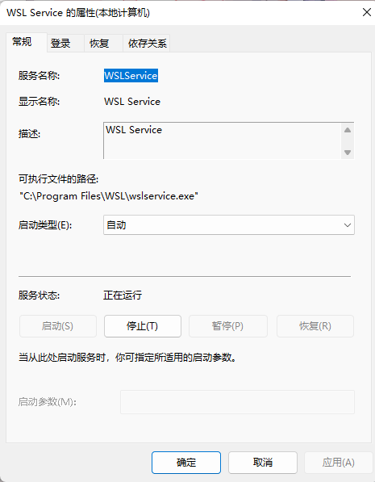

  重启命令行即可修复以上问题

### 2.6 Tensorflow

> Contributors: 叶睿聪 (dgsyrc@github)

> 关于此步的注意事项：请先在windows端自行挂好梯子，否则部分包的下载可能会很慢或者直接失败（也可以尝试更换下载源）
>
> 关于梯子的安装（另附文档）

> 参考文献：
>
> [1] [TensorFlow GPU不可用，WSL2安装\_tensorflow wsl2\_坠星不坠的博客-CSDN博客 - https://blog.csdn.net/](https://blog.csdn.net/qq_40016005/article/details/130203903)

#### 2.6.1 Nvidia 驱动

**安装的是宿主机（Win11）的GPU驱动**

安装电脑GPU对应的Nvidia驱动（查询请在 此电脑-管理-设备管理器-显示适配器 查看）


[Official Drivers | NVIDIA - https://www.nvidia.com/](https://www.nvidia.com/Download/index.aspx)


下载安装即可

#### 2.6.2 CUDA Toolkit 安装

```
wget https://developer.download.nvidia.com/compute/cuda/repos/wsl-ubuntu/x86_64/cuda-wsl-ubuntu.pin
sudo mv cuda-wsl-ubuntu.pin /etc/apt/preferences.d/cuda-repository-pin-600
wget https://developer.download.nvidia.com/compute/cuda/12.1.0/local_installers/cuda-repo-wsl-ubuntu-12-1-local_12.1.0-1_amd64.deb
sudo dpkg -i cuda-repo-wsl-ubuntu-12-1-local_12.1.0-1_amd64.deb
sudo cp /var/cuda-repo-wsl-ubuntu-12-1-local/cuda-*-keyring.gpg /usr/share/keyrings/
sudo apt-get update
sudo apt-get -y install cuda
```

分别执行上述命令，直接等待其下载安装完成即可，若提示 `yes/no` 一律 `yes` ，对于各命令执行后的执行信息可以看后面

下述特殊情况处理对于整个环境安装过程均适用，不止对于CUDA Toolkit

留意其是否报错，若下载卡住请按 `ctrl+C` 终止下载并重新执行

**若终止下载，请先删除原有没下好的包**

若终止的是这步

```
wget https://developer.download.nvidia.com/compute/cuda/12.1.0/local_installers/cuda-repo-wsl-ubuntu-12-1-local_12.1.0-1_amd64.deb
```

则使用下列命令删除

```
rm ./cuda-repo-wsl-ubuntu-12-1-local_12.1.0-1_amd64.deb
```

其余同理

图例：


**命令执行信息**

```
wget https://developer.download.nvidia.com/compute/cuda/repos/wsl-ubuntu/x86_64/cuda-wsl-ubuntu.pin
```


-------------------------

```
sudo mv cuda-wsl-ubuntu.pin /etc/apt/preferences.d/cuda-repository-pin-600
```

无执行信息

-----------------------------------------------------

```
wget https://developer.download.nvidia.com/compute/cuda/12.1.0/local_installers/cuda-repo-wsl-ubuntu-12-1-local_12.1.0-1_amd64.deb
```


--------------------------------------

```
sudo dpkg -i cuda-repo-wsl-ubuntu-12-1-local_12.1.0-1_amd64.deb
```


-----------------------------

```
sudo cp /var/cuda-repo-wsl-ubuntu-12-1-local/cuda-*-keyring.gpg /usr/share/keyrings/
```

无执行信息

-----------------------

```
sudo apt-get update
```

前面Get/Hit的部分留意有没有Ign，如果有请在该命令执行完毕后重新执行一次命令，若依然存在Ign提示请尝试更换网络环境（一般挂了梯子就没这个问题，有的话换条线），后面所有涉及该类提示的同理


-----------------------------

```
sudo apt-get -y install cuda
```

内容过多，执行信息就不全部展示了（仅展示头尾），后面的一些执行信息同理

注意有无报错即可


--------------------------------

#### 2.6.3 Miniconda 安装

分别执行下列命令

```
curl https://repo.anaconda.com/miniconda/Miniconda3-latest-Linux-x86_64.sh -o Miniconda3-latest-Linux-x86_64.sh
```


--------------

```
bash Miniconda3-latest-Linux-x86_64.sh
```


需要按多次回车，直至


输入 `yes` 回车


再次回车确认conda安装位置


这一步同样输入 `yes` 回车即可

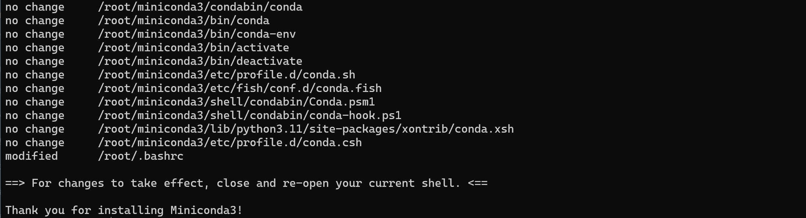

----------------

```
source ~/.bashrc
```

该命令执行后conda就开始运行了


---------------

#### 2.6.4 Conda 环境配置

分别执行下列命令

```
conda create --name tf python=3.9
```


输入 `y` 回车


-------------------

```
conda activate tf
```

前面环境的提示信息变为了tf


-----------------

#### 2.6.5 GPU 配置

> Contributors: 叶睿聪 (dgsyrc@github)、杜雨蒙

如果没有梯子，下的很慢，可以尝试使用豆瓣源，将库名换进来即可

```
pip install （库名） -i http://pypi.douban.com/simple --trusted-host pypi.douban.com
```

分别执行下列命令

```
nvidia-smi
```


看下显卡型号与本机是否一致，本人电脑此处显示为 `NVIDIA GeForce RTX 3060 Laptop` 

--------------------

```
conda install -c conda-forge cudatoolkit=11.8.0
```


输入 `y` 回车


--------------------

```
pip install nvidia-cudnn-cu11==8.6.0.163
```


若提示


可以直接跳过，不影响后面配置

-------------------

#### 2.6.6 环境变量配置

输入

```
mkdir -p $CONDA_PREFIX/etc/conda/activate.d
cd $CONDA_PREFIX/etc/conda/activate.d
gedit env_vars.sh
```

在弹出的编辑器中输入

```
CUDNN_PATH=$(dirname $(python -c "import nvidia.cudnn;print(nvidia.cudnn.__file__)"))
export LD_LIBRARY_PATH=$LD_LIBRARY_PATH:$CONDA_PREFIX/lib/:$CUDNN_PATH/lib
export LD_LIBRARY_PATH=/usr/local/cuda-12.1/lib64/stubs/:/usr/local/cuda-12.1/lib64:/usr/local/cuda-12.1/cudnn/lib:$LD_LIBRARY_PATH
```


**注意**，第三条指令的12.1为CUDA版本，请输入 `nvidia-smi` 查看本机的CUDA Version根据实际情况填写，不要直接复制粘贴

----------------------

#### 2.6.7 Tensorflow 安装

如果没有梯子，下的很慢，可以尝试使用豆瓣源，将库名换进来即可

```
pip install （库名） -i http://pypi.douban.com/simple --trusted-host pypi.douban.com
```

执行下列命令

```
pip install --upgrade pip
```


---------------

```
pip install tensorflow==2.12.0
```


中间信息省略


------------------

#### 2.6.8 验证安装结果

**CPU 验证**

```
python3 -c "import tensorflow as tf; print(tf.reduce_sum(tf.random.normal([1000, 1000])))"
```


**GPU 验证**

```
python3 -c "import tensorflow as tf; print(tf.config.list_physical_devices('GPU'))"
```


若没有上述的信息，输入下面的配置到终端或者关闭终端重新打开再试（要进入tf环境）

```
CUDNN_PATH=$(dirname $(python -c "import nvidia.cudnn;print(nvidia.cudnn.__file__)"))
export LD_LIBRARY_PATH=$LD_LIBRARY_PATH:$CONDA_PREFIX/lib/:$CUDNN_PATH/lib
```

重新执行GPU验证，若依然无法解决，请从前面GPU配置开始重做一次

**至此，环境配置完成**

### 2.7 裁判系统服务器

> Contributors: 邱万理

#### 2.7.1 前期准备

硬件：路由器（以小米路由器为例）、网线

软件：mysql(实际使用感觉非必要）、RoboMaster_Server(很多版本会闪退，自己多换几个赛季的试试，这里以2020年版本为例)

#### 2.7.2 配置路由器

##### 2.7.2.1 连接方式


注意网线和电脑连接时接2号的LAN口，而不是接3号的WAN口

##### 2.7.2.2 开始配置

首先安装上述连接方式连接，Wifi连上Xiaomi并打开小米路由器设置网页http://miwifi.com/

第一次进入会提示设置密码，设置为12345678


进入后到常用设置的WIFI设置中

SSID也就是名称(如图中的Xiaomi_C952)自己定义，但是最好是字母加数字

加密方式设置为WPA2，所以可以设置为强加密

密码必须设置为12345678

其余可以使用默认设置


进入常用设置的局域网设置中

将局域网IP地址设置为192.168.1.１

开启DHCP服务，并且设置开始IP为2(因为作为服务器主机的电脑将要设置为192.168.1.2,所以需要确保可以使用此IP)，结束IP则无严格要求


进入高级设置中的DHCP静态IP分配

添加绑定的设备，设备为作为服务器主机的电脑，IP设置为192.168.1.2

(如果配置不成功可以尝试拔掉网线重新连接)


如果还未成功，设置－＞网络和Internet－＞高级网络设置－＞更改适配器选项

进入WLAN的属性中，点击Internet协议版本４(TCP／IPv4)，打开其属性

改为使用下面的IP地址，并且设置IP地址为192.168.1.2，设置子网掩码为255.255.255.0

（注意关闭防火墙）

确定后关机重启


#### 2.7.3 软件安装

##### 2.7.3.1 MySQL

①进入官网下载MySQL，版本可以选择低一些，mysql-8.0.31-win64.zip

https://dev.mysql.com/downloads/mysql/

②解压缩zip文件，放置在一个简短并且没有中文的文件路径下（如放在`D:\mysql-8.0.31-winx64`)

然后配置一下环境变量(不清楚在哪里自己在设置中搜索环境变量）


系统属性界面右下角的环境变量中，在系统变量找到`Path`


点击编辑，新建一个环境变量名称为刚刚安装的路径再加上`/bin`


③在刚刚的bin文件的同一位置新建一个`data`文件夹和一个`mysql.ini`文件


`mysql.ini`文件先创建一个`.txt`文件，加入以下内容后再修改后缀名变更为`.ini`文件

其中第12行和第15行请自行修改为自己安装的实际位置

```ini
[mysql]

# 设置mysql客户端默认字符集
default-character-set=utf8 

[mysqld]

#设置3306端口
port = 3306 

# 设置mysql的安装目录
basedir=F:\mysql\mysql-5.7.24-winx64\mysql-5.7.24-winx64

# 设置mysql数据库的数据的存放目录
datadir=F:\mysql\mysql-5.7.24-winx64\mysql-5.7.24-winx64\data

# 允许最大连接数
max_connections=200

# 服务端使用的字符集默认为8比特编码的latin1字符集
character-set-server=utf8

# 创建新表时将使用的默认存储引擎
default-storage-engine=INNODB
```

④打开cmd(Win+R）

首先安装mysql，执行以下命令行

```
mysqld install
```

安装成功后启动mysql服务

```
net start mysql
```

服务器启动后，需要输入密码登录（第一次登录没有密码，直接回车即可）

```
mysqladmin -u root -p password
```

修改密码，u后面为用户名（一般都设置为root）,password建议设置为123456或者12345678,忘记密码没有找回方式

```
mysqladmin -u root -p password
```

⑤设置中搜索服务

找到MySQL，设置其为手动启动，避免每次开机自启

后续启动可以cmd输入

```
net start mysql
```

或者再次打开服务界面，右键点击启动也可


##### 2.7.3.2 大疆官方服务器

前往RoboMaster官网下载服务器客户端(RoboMaster产品->裁判系统->软件产品）

各赛季的版本不一定都出来了，并且有些版本的会闪退，自己根据电脑情况多尝试几个版本即可，这里使用的是2020年的服务器客户端

https://www.robomaster.com/zh-CN/products/components/detail/2518


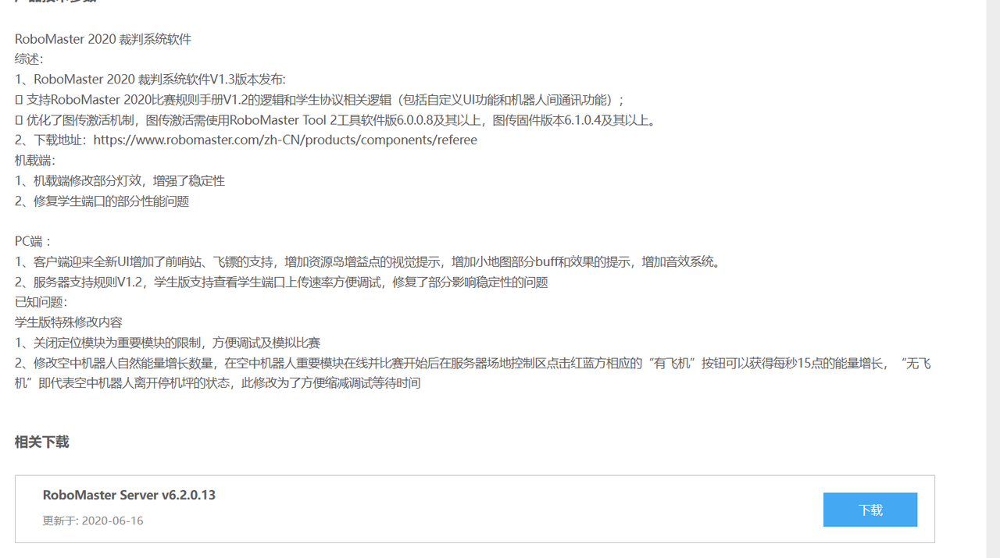

2020赛季的服务器RoboMaster Server里面文件如下图，打开RMServerStart.exe文件，直接点击最下面的StartAll，进入后Play能够打开以下界面即可。


最终效果图


#### 2.7.4 完整流程

当以上3步都能大致实现之后，可以开始使用我们的服务器

①首先连接将路由器与电脑连接，电脑Wifi选择Xiaomi(后面字母和数字为用户自己编号，各不相同就不列举)

并且将电脑的IP地址设置为192.168.1.2,子网掩码设置为255.255.255.0(这一步如果静态DHCP分配设置成功不一定需要，如果配置失败请尝试自己手动修改配置）

②打开MySQL服务

③启动RoboMaster Server软件

④机器人主控模块中点击Wifi设置，扫描

扫描到路由器的Wifi后，长按确定（连接并且记忆该Wifi）

连接成功后可以通过主页面左上角感叹号是否消失判断

#### 2.7.5 可能遇到的问题

- 主控右上角显示连接上Wifi，但是左上角感叹号仍存在？

仅仅是连接上了路由器的Wifi，但是主机并未正确设置为要求的192.168.1.2

目前找到的许多教程中都是在网络设置中设置IP地址和子网掩码来实现，但是实际使用发现并没有设置为预想的IP。

这时请尝试在MiWifi路由器设置网页中，在高级设置中的DHCP静态IP分配里重新为作为服务器主机的电脑分配IP：192.168.1.2

- 路由器不能正常打开配置页面？

电脑注意是使用LAN口，而不是使用WAN口（如果不确定，请都试一遍）

- 下载的服务器客户端打开后闪退？

不清楚是官方问题还是自己电脑问题，遇到此问题只能自己多找几个赛季的软件都试试，一般前期只是用于测试功率等简单功能，不一定需要使用最新赛季的服务器软件

### 2.8 NoMachine

> Contributors: 洪佳

#### 2.8.1 基本介绍

**NoMachine**是一款**远程桌面软件**。适用于Linux、windows、[ARM](https://so.csdn.net/so/search?q=ARM&spm=1001.2101.3001.7020)、Android等几乎全系统。常见的远程桌面软件还有向日葵、ToDesk等。选择NoMachine是因为它**支持ARM32位、ARM64位处理器**。

#### 2.8.2 安装NoMachine

- 官网下载地址：[NoMachine - Download Free Remote Desktop Access](https://downloads.nomachine.com/)


点击`for Linux`


使用以下代码查一下你的架构， 我的是x86_64，选择DEB amd64(Ubuntu专门下载的)

```
uname -a 
```


点击download，注意安装目录，下载完双击打开即可，进行安装

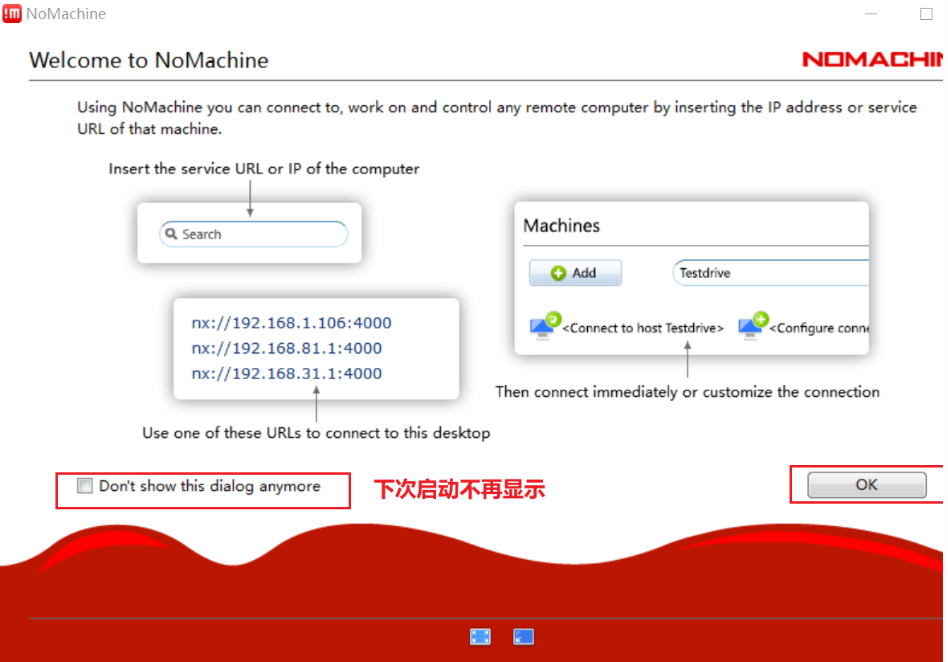

安装完成后有服务端和客户端，打开客户端

客户端成功打开如上图，第一次进入有官方使用说明，点ok不断继续即可

#### 2.8.3 使用介绍


注意：控制端至少应该下载NoMachine的服务端，才能顺利连接

### 2.9 中文输入法安装(Ubuntu)

> Contributors: 洪佳

> 参考文献：
>
> [8] [ubuntu安装搜狗输入法，图文详解+踩坑解决-CSDN博客 - https://blog.csdn.net/](https://blog.csdn.net/qq_42257666/article/details/129098009)
>
> [9] [ubuntu系统安装好搜狗输入法后只能输入英文，无法输入中文的解决方案_ubuntu搜狗输入法无法输入中文-CSDN博客 - https://blog.csdn.net/](https://blog.csdn.net/qq_39779233/article/details/128086129?csdn_share_tail={"type"%3A"blog"%2C"rType"%3A"article"%2C"rId"%3A"128086129"%2C"source"%3A"Hong_J_0826"}&fromshare=blogdetail)

#### 2.9.1 添加中文语言支持

系统设置—>区域和语言—>管理已安装的语言—>在“语言”tab下—>点击“添加或删除语言”


弹出“已安装语言”窗口，勾选中文（简体），点击应用


回到“语言支持”窗口，在键盘输入法系统中，选择`fcitx`


如果你没有`fcitx`选项，先打开终端手动安装`fcitx`，等安装成功之后再执行上述步骤：

```
sudo apt-get install fcitx
```


点击“应用到整个系统”，会输入密码进行验证，然后关闭窗口，重启电脑

然后设置`fcitx`为开机自启动

```
sudo cp /usr/share/applications/fcitx.desktop /etc/xdg/autostart/
```

#### 2.9.2 下载安装包

打开终端输入`uname -a` 查看系统架构
进入[搜狗输入法`linux`下载页面](https://shurufa.sogou.com/linux)，选择适合你ubuntu架构的版本download


#### 2.9.3 安装输入法和依赖

①安装输入法

```
cd 安装包目录
sudo dpkg -i sogoupinyin_版本号.deb
```

②安装所需依赖，完成后重启电脑。

```
sudo apt install libqt5qml5 libqt5quick5 libqt5quickwidgets5 qml-module-qtquick2
sudo apt install libgsettings-qt1
```

#### 2.9.4 配置输入法

①查看桌面右上角的键盘图标，看到列表中出现了搜狗，需要配置一下才能使用


②点击配置当前输入法，进入输入法配置界面，我的和原作者一样是直接自动添加好了（如果你也是看完3和4点再来尝试），正常来说这里是没有添加搜狗输入法的


如果你点配置，出现以下报错，就是缺少图形界面的依赖，需要安装一下`fcitx-config-gtk`

```
sudo apt install fcitx-config-gtk
```

③点击+号，然后弹出“添加输入法”的窗口，这里一定要把下面的“仅显示当前语言”取消勾选，然后在下面的搜索框中输入`sogou`，再选择搜狗输入法，点击确认添加进来


4)如果在2步是自动添加好的搜狗输入法，选中搜狗输入法点`-`取消掉，然后再执行第3步，不然你永远也调不出来搜狗输入法或者输入中文。

#### 2.9.5 其他

①上面步骤做完后可以使用搜狗输入法但是只能输入英文，这可能是缺少包导致的，你可以去官网重新下载deb安装包进行尝试

也可以尝试一下下载以下两个包

```
sudo apt-get install libqt5qml5 libqt5quick5 libqt5quickwidgets5 qml-module-qtquick2
sudo apt install libgsettings-qt1
```

②设置输入法的快捷键，你既可以在系统提供的配置窗口设置，显示高级选项会有更多的设置；

也可以点击搜狗输入法的悬浮窗上的设置按钮，进行直接设置。

### 2.10 cmake

> Contributor: 叶睿聪 (dgsyrc@github)

#### 2.10.1 一般安装

使用以下命令安装即可

```
sudo apt-get install cmake
```

#### 2.10.2 更新版本

考虑到部分库的编译对cmake的版本要求较高，在 `2.10.1` 中提到的方式安装的版本不能满足要求

因此需要下载cmake的新版本源码手动编译安装

链接 ：[Download CMake - https://cmake.org/](https://cmake.org/download/)

下载对应Linux版本的 `.tar.gz` 压缩包即可

下载后使用以下命令解压（若同一目录下只有一个 `.tar.gz` 格式压缩包，可以不输入完整压缩包名称解压）

```
tar -xzvf ***.tar.gz
```

解压完成后，依次执行以下命令安装依赖以及编译安装（要在cmake目录下）

```
sudo apt-get install g++
sudo apt-get install libssl-dev 
./configure
make
sudo make install
```

检查安装后的版本

```
cmake --version
```

举例：


### 2.11 onnxruntime

> Contributor: 叶睿聪 (dgsyrc@github)

下载源码（源码较大，请确保网络通畅）

```
git clone --recursive https://github.com/Microsoft/onnxruntime
```

安装必要环境

```
sudo apt-get install python-dev-is-python3
sudo apt-get install python3-numpy-dev
sudo apt-get install python3-packaging
sudo apt-get install python3-setuptools
sudo apt-get install python3-wheel
```

在 `onnxruntime` 文件夹下编译

```
sudo ./build.sh --config RelWithDebInfo --build_shared_lib --parallel --allow_running_as_root
```

此时可能会提示cmake版本过低，请根据 `2.10` 内容升级cmake


升级完成后重新执行上述命令即可成功编译（编译时间较长）

**可以用以下方式节省编译时间**

> 在看到开始编译时（如下图）
>
> 
>
> 按下 `Ctrl+C` 终止编译
>
> 在 `onnxruntime/build/Linux/RelWithDebInfo` 目录下使用以下命令
>
> ```
> sudo cmake --build /home/nuc02/Desktop/onnxruntime/build/Linux/RelWithDebInfo --config RelWithDebInfo -j12
> ```
>
> 注意编译时是否有报错
>
> **报错1**
>
> 
>
> 缺少python环境
>
> 此时应输入以下指令安装环境
>
> ```
> sudo apt-get install python-dev-is-python3
> ```
>
> **报错2**
>
> 
>
> 缺少 `numpy` 库
>
> 输入以下指令安装环境
>
> ```
> sudo apt-get install python3-numpy-dev
> ```
>
> 安装完成后再重新编译
>
> 使用加速编译最后需要重新执行一次原本正常编译的指令检查
>
> ```
> sudo ./build.sh --config RelWithDebInfo --build_wheel --update --build --allow_running_as_root
> ```
>
> 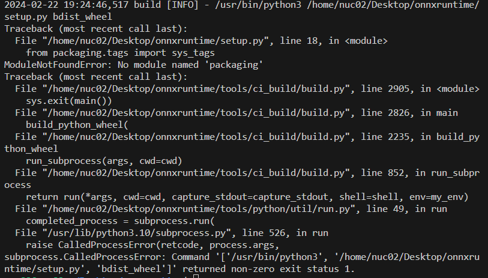
>
> 若报以上错误，可以忽略直接下一步

编译完成后

在 `onnxruntime/build/Linux/RelWithDebInfo` 或 `onnxruntime/build/Linux/Release` 下执行以下命令安装（上面加速的步骤可能会导致编译的文件无法转移至 `Release`  )

```
sudo make install
```

<div STYLE="page-break-after: always;"></div>

## 3 视觉知识

### 3.1 OpenCV

#### 3.1.1 常见错误

- 路径正确，视频无法读取且无法保存录制的视频

  **原因：**ffmpeg未安装

  **解决方案：** 检查以下依赖是否安装

  ```
  sudo apt-get install libgtk2.0-dev pkg-config libavcodec-dev libavformat-dev libswscale-dev
  ```

  安装完成后重新编译安装opencv即可

  注意在执行 `cmake ..` 后终端的输出信息，如 `ffmpeg` 部分提示为 `YES` 即可继续编译安装

  

- 视频可读取，但相机录制视频无法保存

  

  **原因：** fps, frameSize 参数错误（一般表现为0）

  **解决方案：** fps与frameSize手动设置即可，不使用 `cv::videoCapture` 的成员函数读取

### 3.2 ROS

> Contributors: 刘明楷（milchstrasse565@github）

#### 3.2.1 实操学习

- 屏蔽导航包里的速度发布语句

- 自己的ros程序替代导航包控制机器人

  - 订阅里程计/odom，发布速度/cmd_vel，让机器人直线运动1m停止（熟悉订阅/发布/坐标系/消息格式）

- 取消订阅里程计话题获取定位，改为监听map坐标系与机器人本体坐标系的TF获取定位（熟悉TF与TF树）

- 以上一步的定位为基础，进一步订阅导航包生成的局部轨迹，以任意方式实现机器人沿着轨迹进行运动，如使用恒定线速度，用PID的P控制角速度（进一步夯实）

- 慢慢逐步替换开源导航包的规划、控制、定位、建图等所有或某个模块、再进行优化

- 其他必学
  - 各种消息格式
  - rviz可视化调试 
  - TF坐标变换
  - TF监听与广播
  - launch文件与参数配置
  - cmake编译规则设置
  - rosbag数据记录、回放

### 3.3 yolov8

> Contributors: 程英杰

#### 3.3.1 目标检测与语义分割的区别

##### 3.3.1.1 语义分割的目标

语义分割的任务是对输入的图像进行逐像素的分类，标记出像素级别的物体。


如上图，图1中把猫、天空、树、草地进行了逐像素的分类；图2中把牛、天空、树、草地进行了逐像素的分类。

##### 3.3.1.2 目标检测的目标

目标检测的任务是对输入的图像进行物体检测，标注物体在图像上的位置，以及该位置上物体属于哪个分类。


如上图，模型把图中的人、狗、马分别进行了位置标注，并且也给出了对应的分类类别。

##### 3.3.1.3 小结

蕴含信息都包含分类信息和位置信息。

但是语义分割所标记的物体是像素级别的颗粒度的，而目标检测标记的物体是其外切框。

#### 3.3.2 训练

##### 3.3.2.1 安装

Pytorch环境安装省略

```bash
pip install ultralytics
```

##### 3.3.2.2 准备数据集

Yolo团队为模型设计了专用数据集格式"YOLO"，要训练yolov8，必须确认数据集为yolo格式。

yolo直接采用txt文件保存模型的labels标签，如下图，每一行都代表着该图像中的一个标签GT


目前大部分数据集的保存都是以voc格式，如果你拿到了voc格式的数据集，需要进行转换。

相关链接：[https://blog.csdn.net/kuabiku/article/details/132088402]()

本次使用西南大学 已标注数据集链接： https://pan.baidu.com/s/1oMtdgmBN5xQZTbv2bSLtog?pwd=z3gc

该数据集的标签数据已经是yolo格式

**处理数据集并调整配置文件**

模型训练配置文件(config.yaml)示例：

```yaml
path: data_xn # dataset root dir
train: images/train # ./data_xn/images/train
val: images/test # ./data_xn/images/test
test: # test images (optional)

# Classes
names:
  0: person
  1: bicycle
  2: car
# ...
```

其中  `path`  是数据集相对于`config.yaml`所在目录的路径，也可以填写绝对路径

`train`和`val`分别是训练集和评估集，该字段中的路径将会与`path`中的路径相拼接

`names`是模型分类数据的信息，从`0`开始，分类数量应不小于训练数据中所标注的类别标签的数量。`西南大学 已标注数据集`的最大类别为35，因此`names`中的分类应该从`0`-`34`.

`西南大学 已标注数据集`数据集文件夹`data_xn`的存放格式应该更改为：

```bash
data_xn
    ├─images
    │  ├─test
    │  └─train
    ├─labels
    │  ├─test
    │  └─train
```

其中，`images`下每个子目录中直接存放了图片；`labels`下每个子目录中存放了对应的标注数据(txt文件)

> *训练前，ultralytics会自动读取这写文件夹下的每张图片和标注，并生成* **缓存** *以便于下次训练直接复用。因此如果对数据集进行了改动，再次训练时应将缓存文件* `data_xn/labels/train.cache`和`data_xn/labels/test.cache` *删去以应用更改*

##### 3.3.2.3 训练

**准备预训练模型**

对于不同任务，Yolov8准备了不同的预训练模型，具有不同的输出格式。目标检测是Yolov8的主任务，因此所有模型均可使用。


下载地址：[Releases · ultralytics/assets · GitHub](https://github.com/ultralytics/assets/releases) 提供了ultralytics库提供的所有预训练模型的下载，此处下载最小的默认模型

下载命令：

```bash
wget https://github.com/ultralytics/assets/releases/download/v8.1.0/yolov8n.pt
```

**编写训练代码**

在项目根目录创建`datasets`，并将准备好的数据集`data_xn`剪切进去。

将下载好的预训练模型文件`yolov8n.pt`放入项目根目录

在项目根目录创建`train.py`:

```python
from ultralytics import YOLO
if __name__ == "__main__":

    # 加载预训练数据集
    model = YOLO('yolov8n.pt')
    
    # 按照配置文件的定义开始训练，训练3个epochs
    results = model.train(data='config.yaml', epochs=3,lr0=1E-2)

    # model.val()
    # train方法在训练完成后自动对模型进行评估， 因此不需要调用 model.val()

    #导出模型为ONNX格式
    model.export(format='onnx', dynamic=True)
```

> 由于Windows下处理数据集需要创建多个workers，因此，需要将接口调用写在__main__下以防止`Freeze_support Error`
>
> 

**然后运行train.py就可以开始训练了**

**查看训练结果**

训练结果保存在项目根目录`runs`文件夹下，`runs/detect`存放了`目标检测`任务的训练模型和评估结果

关于评估指标的解释，见：[https://blog.csdn.net/java1314777/article/details/134154676]()

模型(权重)文件存放在相应模型文件夹中的`weights`文件夹

#### 3.3.3 使用ONNX调用

[生成ONNX文件参考资料](https://docs.ultralytics.com/modes/export/)

ONNX Runtime提供了跨平台调用模型的统一接口

生成并使用ONNX文件的步骤如下:

1. 生成ONNX文件:
   从下面的文件结构开始,通过上面的步骤已经得到了训练过程当中综合准确率最好的模型`best.pt`和模型最后的训练结果`last.pt`
2. 

然后是在pycharm控制台打开之前下载了 `ultralytics`的anaconda环境，然后在控制台输入下面的指令

~~~bash
yolo export model=runs/detect/train6/weights/best.pt format=onnx  int8=true simplify=true dynamic=true
~~~

在`best.pt`所在的文件夹当中得到了`best.onnx`。

>参数解释
>前两个命令 yolo export 指的是使用yolo的相关命令 做导出任务
>model后面跟的参数是训练得到的模型文件路径
>format后面是模型导出的格式 [(yolo官网上模型导出的格式)](https://docs.ultralytics.com/zh/modes/export/#arguments)
>后面的参数也是官网上的相关介绍
>
>
>
>这里我使用了 int8 simplify dynamic 用来简化模型加快计算速度


当然根据官网也可以使用python将模型文件导出 下面是相关的代码

~~~python
from ultralytics import YOLO
# Load a model
model = YOLO('runs/detect/train6/weights/best.pt')  # load a custom trained model
# Export the model
model.export(format='onnx', int8=True, dynamic=True, simplify=True)
~~~


2. 编写python调用ONNX文件
   [调用ONNX文件参考资料](https://zhuanlan.zhihu.com/p/670622368)

首先先import这些库文件

~~~python 
import onnxruntime as ort
import cv2
import numpy as np
~~~

然后加载ONNX文件

~~~python
import onnxruntime as ort
session = ort.InferenceSession("yolov8m-seg.onnx", providers=["CPUExecutionProvider"]) # 使用CPU加载计算模型
~~~

后续的代码和相关的解释都在注释当中写的比较详细,这里就直接贴代码了

~~~python
# %%
import onnxruntime as ort
import cv2
import numpy as np

# 这个函数是将图片数据转换为模型输入格式 (预处理函数)
def prepare_input(bgr_image, width, height):
    image = cv2.cvtColor(bgr_image, cv2.COLOR_BGR2RGB)  # 将图片从BGR格式转换为RGB格式
    # cv2.imshow(bgr_image)
    image = cv2.resize(image, (width, height)).astype(np.float32) # 将图片resize到模型输入尺寸640x640
    image = image / 255.0  #归一化
    image = np.transpose(image, (2, 0, 1)) # 将图像数据的通道顺序由HWC调整为CHW
    input_tensor = np.expand_dims(image, axis=0) # 扩展数据维度，将数据的维度调整为NCHW
    #axis=0表示在第0维增加一个维度
    #经过预处理后，输入数据input_tensor的维度变为[1, 3, 640, 640]，与模型的输入尺寸一致。
    return input_tensor
# 计算两个方框之间的IOU值的大小 计算方式是 两个方框交集面积/并集面积
# 参考资料 http://t.csdnimg.cn/zTN73
def iou(rec_1,rec_2):
        '''
        rec_1:左上角(rec_1[0],rec_1[1])    右下角：(rec_1[2],rec_1[3])
        rec_2:左上角(rec_2[0],rec_2[1])    右下角：(rec_2[2],rec_2[3])
        （rec_1）
        1--------1
        1   1----1------1
        1---1----1      1
            1           1
            1-----------1 （rec_2）
        '''
        s_rec1=(rec_1[2]-rec_1[0])*(rec_1[3]-rec_1[1])   #第一个bbox面积 = 长×宽
        s_rec2=(rec_2[2]-rec_2[0])*(rec_2[3]-rec_2[1])   #第二个bbox面积 = 长×宽
        sum_s=s_rec1+s_rec2                              #总面积
        left=max(rec_1[0],rec_2[0])                      #交集左上角顶点横坐标
        right=min(rec_1[2],rec_2[2])                     #交集右下角顶点横坐标
        bottom=max(rec_1[1],rec_2[1])                    #交集左上角顶点纵坐标
        top=min(rec_1[3],rec_2[3])                       #交集右下角顶点纵坐标
        if left >= right or top <= bottom:               #不存在交集的情况
            return 0
        else:
            inter=(right-left)*(top-bottom)              #求交集面积
            iou=(inter/(sum_s-inter))*1.0                #计算IOU
            return iou
session = ort.InferenceSession(
     "D:\\ProgramFiles\\ultralytics-main\\runs\\detect\\train6\\weights\\best.onnx", # 模型文件路径 
     providers=["CPUExecutionProvider"])  # 模型路径 还有使用CPU计算
video = cv2.VideoCapture("D:\\opencv_image\\video_zhuangjiaban.mp4") # 读取视频文件
# %%
# 1. 把OpenCV读取的BGR格式的图片转换为RGB格式；
# 2. 把图片resize到模型输入尺寸640x640；
# 3. 对像素值除以255做归一化操作；
# 4. 把图像数据的通道顺序由HWC调整为CHW；
# 5. 扩展数据维度，将数据的维度调整为NCHW。
while True:
    model_width = 640
    model_height = 640
    ret, image = video.read()
    if(ret==False):
       continue      
    image_height, image_width, _ = image.shape
    input_tensor = prepare_input(image, model_width, model_height)
    outputs = session.run(None, {session.get_inputs()[0].name: input_tensor})
    # %%
    #squeeze函数是用于删除shape中为1的维度，对output0做transpose操作是为了方便后续操作
    # print(outputs[0].shape)
    output0 = np.squeeze(outputs[0]).transpose()
    # print("outputs[0].shape shape:", outputs[0].shape)
    # print("output0 shape:", output0.shape)
    # %%
    boxes = output0
    # print(boxes.shape) # 输出结果是 (8400,40
    # 这里的boxes是一个二维数组，第一维是目标框的数量，第二维是目标框的属性，包括目标框的坐标和类别概率等信息。
    # 咱们细说第二维的属性：前4个元素是目标框的坐标信息，分别是目标框的中心坐标(x,y)和宽高(w,h)，后36个元素是目标框的类别概率信息，每个类别的概率占4个元素。
    # 所以[8400,40] 就代表着 8400个目标框，每个目标框有40个属性
    # boxes shape: (8400, 84)
    # masks shape: (8400, 32)
    # %%
    objects = []
    for row in boxes:
        prob = row[4:40].max()
        if prob < 0.2:
            continue
        class_id = row[4:40].argmax()
        label = class_id
        xc, yc, w, h = row[:4]
        # // 把x1, y1, x2, y2的坐标恢复到原始图像坐标
        x1 = (xc - w / 2) / model_width * image_width
        y1 = (yc - h / 2) / model_height * image_height
        x2 = (xc + w / 2) / model_width * image_width
        y2 = (yc + h / 2) / model_height * image_height
        # // 获取实例分割mask
        # mask = get_mask(row[84:25684], (x1, y1, x2, y2), image_width, image_height)
        # // 从mask中提取轮廓
        # polygon = get_polygon(mask, x1, y1)
        objects.append([x1, y1, x2, y2, label, prob])
    # %%
    objects.sort(key=lambda x: x[5], reverse=True)
    # %%
    # objects.sort(key=lambda x: x[5], reverse=True)
    # // NMS
    results = []
    while len(objects) > 0:
        print(objects[0])
        results.append(objects[0]) # 我们想要与第一个框进行比较 所以不能让第一个框和自己作比较
        # 如果 iou过大(超过了0.5)的话 就删除这个object 保留iou小的object
        objects = [object for object in objects if iou([object[0],object[1],object[2],object[3]], 
                                                    [objects[0][0],objects[0][1],objects[0][2],objects[0][3]]) < 0.5]
        # 这里就是将 objects中和第一个object的iou大于0.5的object删除掉
    # %%
    # 定义矩形的左上角和右下角坐标
    # 设置矩形颜色为红色（BGR格式）
    color = (0, 0, 255)
    thickness = 1 # 若想要填充矩形则将此值改为-1或者大于等于0的数字
    # 在图像上绘制矩形
    for result in results:
        print(result)
        start_point = (int(result[0]), int(result[1]))
        end_point = (int(result[2]), int(result[3]))
        cv2.rectangle(image, start_point, end_point, color, thickness)
    cv2.imshow('window name',image)
    if cv2.waitKey(10) & 0xFF == ord('q'):
            break
cv2.destroyAllWindows()
~~~


### 3.4 IMU与里程计融合

> Contributors: 洪佳

> 参考文献：
>
> [5] [IMU和里程计融合_轮式里程计和imu融合-CSDN博客 - https://blog.csdn.net/](https://blog.csdn.net/baimei4833953/article/details/80768762)
>
> [6] [什么是IMU？-CSDN博客 - https://blog.csdn.net/](https://blog.csdn.net/su_fei_ma_su/article/details/125947605)
>
> [7] [一文了解IMU原理、误差模型、标定、惯性传感器选型以及IMU产品调研(含IMU、AHRS、VRU和INS区别)_imu寄存器值计算重力-CSDN博客 - https://blog.csdn.net/](https://blog.csdn.net/QLeelq/article/details/112985306?csdn_share_tail={"type"%3A"blog"%2C"rType"%3A"article"%2C"rId"%3A"112985306"%2C"source"%3A"Hong_J_0826"}&fromshare=blogdetail)

#### 3.4.1 概述

实际使用小车的过程中，光有麦轮的里程计计算是不够的，因为实际使用过程中经常会出现轮子打滑和数据出现累计误差的情况，所以我们可以从使用IMU和里程计融合的角度来对系统“升级”。

#### 3.4.2 IMU

##### 3.4.2.1 简述

IMU 一般指6轴传感器，内部包含了3轴陀螺仪和3轴加速度计，3轴就是表示 XYZ 平面下的3个坐标轴。

3轴陀螺仪测量的是每个轴上面的角速度，精度一般为 °/s ，也就是按照这个趋势旋转，每秒钟能走过的度数。

3轴加速度计测量的是每个轴所受的重力加速度，比如传感器水平放置水平地面时，理论上只受到z轴负向的重力加速度，大小为 $9.8 m/s^2$

##### 3.4.2.2 原理

详细了解：

[一文了解IMU原理、误差模型、标定、惯性传感器选型以及IMU产品调研(含IMU、AHRS、VRU和INS区别)_imu寄存器值计算重力-CSDN博客 - https://blog.csdn.net/](https://blog.csdn.net/QLeelq/article/details/112985306?csdn_share_tail={"type"%3A"blog"%2C"rType"%3A"article"%2C"rId"%3A"112985306"%2C"source"%3A"Hong_J_0826"}&fromshare=blogdetail)

#### 3.4.3 IMU数据获取

##### 3.4.3.1 数据接口

数据接口，通过配置可以输出原始 `ros_imu topic`

还有更多方法

##### 3.4.3.2 滤波

ROS提供的相关包`imu_tools`进行滤波

可以看到`complementary_filter_gain_node`会订阅该`topic`，即该`topic`作为输入滤波得到最终数据(发布`/imu/data` `topic` 类型同样为`sensor_msgs/Imu`)

#### 3.4.4 融合方法

##### 3.4.4.1 直接融合

从`imu`得到的数据为一个相对角度(主要使用`yaw`，`roll`和`pitch` 后面不会使用到)，使用该角度来替代由编码器计算得到的角度。
这个方法较为简单，出现打滑时候因`yaw`不会受到影响，即使你抬起机器人转动一定的角度，得到的里程也能正确反映出来

##### 3.4.4.2 卡尔曼滤波

**概述**

官方卡尔曼滤波的包[`robot_pose_ekf`](http://wiki.ros.org/robot_pose_ekf)，`robot_pose_ekf`开启扩展卡尔曼滤波器生成机器人姿态，支持

- `odom`（编码器）
- `imu_data`（IMU）
- `vo`（视觉里程计）
  还可以支持[GPS](http://wiki.ros.org/robot_pose_ekf/Tutorials/AddingGpsSensor）

**配置**

可以在 `robot_pose_ekf` 包目录中找到 EKF 节点的默认启动文件。启动文件包含许多可配置的参数：

- `freq`：过滤器的更新和发布频率。请注意，随着时间的推移，更高的频率会为您提供更多的机器人姿势，但不会提高每个估计的机器人姿势的准确性。
- `sensor_timeout`：当传感器停止向过滤器发送信息时，过滤器应该等待多长时间才能在没有该传感器的情况下继续工作。
- `odom_used`、`imu_used vo_used`：启用或禁用输入。

可以在启动文件中修改配置，如下所示：


**运行**

创建程序包：

```
 $ rosdep install robot_pose_ekf
 $ roscd robot_pose_ekf
 $ rosmake
```

**Run** the `robot pose ekf`

```
 $ roslaunch robot_pose_ekf.launch
```

**相关节点**

①robot_pose_ekf

`robot_pose_ekf`实现了一个扩展的卡尔曼滤波器，用于确定机器人姿态。

②Subscribed Topics

`Odom` （[`nav_msgs/里程计`](http://docs.ros.org/en/api/nav_msgs/html/msg/Odometry.html))

- **2D** pose（由车轮里程计使用）：2D 姿势包含机器人在地平面上的位置和方向以及该姿势的协方差。发送此 2D 姿势的消息实际上表示 3D 姿势，但 z、滚动和俯仰被简单地忽略。

`imu_data` （[`sensor_msgs/Imu`](http://docs.ros.org/en/api/sensor_msgs/html/msg/Imu.html))

- 3D orientation（由 IMU 使用）：**3D 方向**提供有关机器人底架相对于世界参考系的滚动角、俯仰角和偏航角的信息。横滚角和俯仰角被解释为绝对角度（因为 IMU 传感器具有重力参考），偏航角被解释为相对角度。协方差矩阵指定了方向测量的不确定度。`robot_pose_ekf` 在仅接收有关此主题的消息时不会启动;它还需要有关“VO”或“Odom”主题的消息。

`vo`（[`nav_msgs/`里程计](http://docs.ros.org/en/api/nav_msgs/html/msg/Odometry.html))

- **3D** pose（由视觉里程计使用）：3D pose表示机器人的完整位置和方向以及该pose的协方差。当传感器仅测量 3D 姿势的一部分时（例如，车轮里程计仅测量 2D 姿势），只需在未实际测量的 3D pose部分上指定较大的协方差即可。

`robot_pose_ekf`节点不要求所有三个传感器源始终可用。每个源都给出了pose估计值和协方差。这些源以不同的速率和不同的延迟运行。源可以随时间推移出现和消失，节点将自动检测并使用可用的传感器。若要添加自己的传感器输入，请查看[添加 GPS 传感器教程](http://wiki.ros.org/robot_pose_ekf/Tutorials/AddingGpsSensor)

③Published Topics

`robot_pose_ekf/odom_combined` （[geometry_msgs/PoseWithCovarianceStamped](http://docs.ros.org/en/api/geometry_msgs/html/msg/PoseWithCovarianceStamped.html))

- 过滤器的输出（估计的 3Drobot pose）

④提供的` tf` 转换

```
odom_combined`→`base_footprint
```

##### 3.2.4.3 工作原理

**Poes解释**

所有向滤波器节点发送信息的传感器源都可以有自己的世界参考系，并且每个*世界*参考系都可以随时间任意漂移。因此，不同传感器发送的**absolute Pose**无法相互比较。该节点使用每个传感器的**relative pose differences**来更新扩展的卡尔曼滤波器。

**协方差解释(Covariance interpretation)**

随着机器人四处移动，其在世界参考中pose的不确定性越来越大。随着时间的流逝，协方差将无限增长。因此，发布pose本身的协方差是没有用的，相反，传感器源会发布协方差如何随时间变化，即速度上的协方差。*请注意，使用对世界的观察（例如，测量到已知墙壁的距离）将减少机器人姿势的不确定性;然而，这是定位，而不是里程计。*

**Timing**

想象一下，机器人姿势过滤器上次更新的时间是t_0。在*到达每个*传感器的至少一次测量值且时间戳晚于 t_0 之前，节点不会更新机器人姿势过滤器。例如，当在时间戳t_1 > t_0的 `odom` 主题和时间戳t_2 > t_1 > t_0的 `imu_data` 主题上收到消息时，过滤器现在将更新到有关所有传感器的信息可用的最新时间，在本例中为时间t_1。直接给出t_1处的 `odom` 位姿，通过对 t_1 和 t_0 之间的 `imu` 位姿进行线性插值得到 t_2 处的 `imu `位姿。机器人姿势过滤器使用` odom `和` imu `的相对姿势进行更新，介于 t_0 和 t_1 之间。


上图显示了PR2机器人从给定的初始位置（绿点）开始，驱动并返回初始位置时的实验结果。完美的里程计 x-y 图应显示精确的闭环。蓝线表示车轮里程计的输入，蓝点表示估计的结束位置。红线表示`robot_pose_ekf`的输出，它结合了车轮里程计和`imu`的信息，红点是估计的结束位置。

**包裹状态**

①稳定性

这个包的代码库已经过很好的测试，并且已经稳定了很长时间。然而，随着消息类型的演变，ROS API 一直在变化。在未来的版本中，ROS API 可能会再次更改为简化的单主题界面（请参阅下面的路线图）。

②路线图

- 该滤波器目前设计用于我们在 PR2 机器人上使用的三个传感器信号（车轮里程计、`imu` 和 `vo`）。我们计划使这个包更加通用：未来的版本将能够监听“n”个传感器源，所有源都发布（[`nav_msgs/`里程计](http://docs.ros.org/en/api/nav_msgs/html/msg/Odometry.html)）消息。每个源都将在里程计消息中设置 3D 姿势的协方差，以指定它实际测量的 3D 姿势的哪一部分。
- 我们想将速度添加到扩展卡尔曼滤波器的状态中。

### 3.5 麦轮底盘运动学解算

> Contributors: 洪佳

> 参考文献：
>
> [10] [ROS机器人学习——麦克纳姆轮运动学解算-CSDN博客 - https://blog.csdn.net/](https://blog.csdn.net/oXiaoLingTong/article/details/120198677)

#### 3.5.1 麦轮概述

RM战车所用的轮子均为麦克纳姆轮，这种轮子安装方式与普通轮子无异，可安装于平行轴上，但是麦克纳姆轮可以实现全向移动，即前后运动、水平移动、绕中心自转。正因为以上优点，许多工业上的全向移动平台都会应用这种轮子。缺点也有，就是不耐磨，需要定期更换。

（全向轮与麦克纳姆轮的共同点在于他们都由两大部分组成：轮毂和辊子（roller）。轮毂是整个轮子的主体支架，辊子则是安装在轮毂上的鼓状物。全向轮的轮毂轴与辊子转轴相互垂直，而麦克纳姆轮的轮毂轴与辊子转轴呈 45° 角。理论上，这个夹角可以是任意值，根据不同的夹角可以制作出不同的轮子，但最常用的还是这两种。）

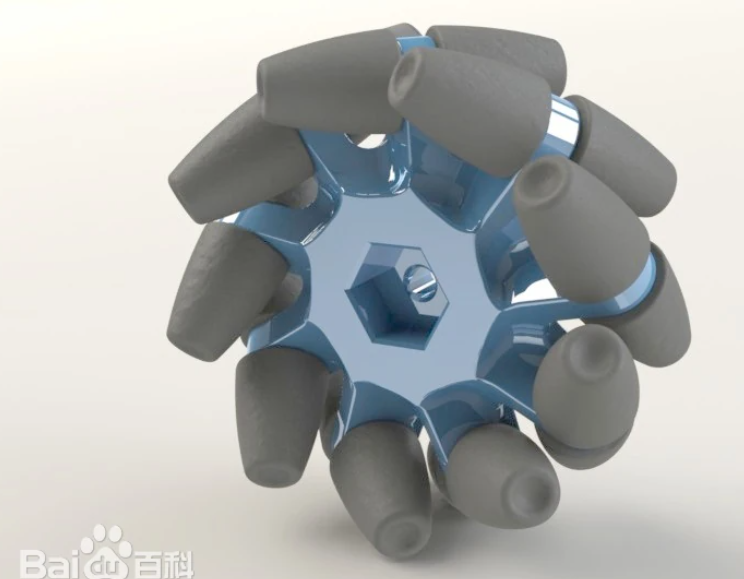

#### 3.5.2 麦轮安装

同轴安装，分为左旋和右旋两种

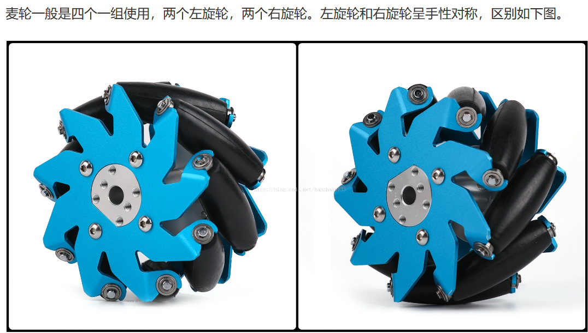

安装方式如下图，分别为：**X-正方形（X-square）、X-长方形（X-rectangle）、O-正方形（O-square）、O-长方形（O-rectangle）**


- X-正方形：轮子转动产生的力矩会经过同一个点，所以 yaw 轴无法主动旋转，也无法主动保持 yaw 轴的角度。
- X-长方形：轮子转动可以产生 yaw 轴转动力矩，但转动力矩的力臂一般会比较短。
- O-正方形：四个轮子位于正方形的四个顶点，平移和旋转都没有任何问题。
- O-长方形：轮子转动可以产生 yaw 轴转动力矩，而且转动力矩的力臂也比较长。是最常见的安装方式。

#### 3.5.3 运动学模型

##### 3.5.3.1 基础知识

**坐标系统**

使用右手定义,对于ROS机器人，如果以它为坐标系的原点，那么

|  轴  | 方位 |
| :--: | :--: |
| x轴  | 前方 |
| y轴  | 左方 |
| z轴  | 上方 |

**旋转运动**

使用右手定义：

围绕 z轴正旋转 是 逆时针旋转

**测量单位**
ROS使用公制 ：

线速度：m/s
角速度：rad/s

##### 3.5.3.2 底盘运动学解算

以下以**O-长方型**安装方式进行解算

- 底盘中心


- 麦轮轴心（取右上角麦轮即一号轮子分析）

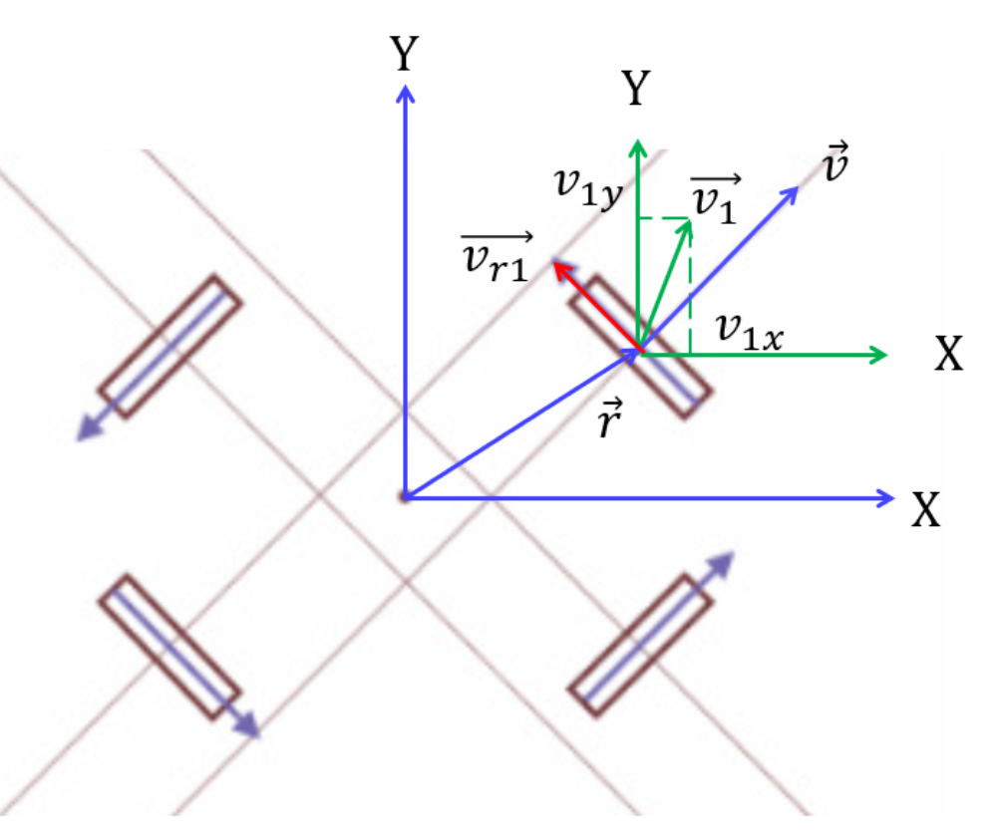


##### 3.5.3.3 逆运动学解算

逆运动学模型（inverse kinematic model）得到的公式可以根据底盘的运动状态解算出四个轮子的速度

①轮子轴心速度


②辊子方向的速度分量v1∥


③轮子转速


④整合得出底盘四个轮子转速，即底盘运动学模型


##### 3.5.3.4 正运动学解算

正运动学模型（forward kinematic model）让我们可以通过四个轮子的速度，计算出底盘的运动状态。可以直接根据逆运动学模型中的三个方程解出来。

转换为底盘坐标系下对时间求积分即为里程计变化量

#### 3.5.4 代码实现

代码参考：http://t.csdnimg.cn/ldXqr

### 3.6 catkin_make编译

> Contributors: 洪佳

> 参考文献：
>
> [11] [ROS从入门到精通系列（五）catkin详解与catkin_make编译-CSDN博客 - https://blog.csdn.net/](https://blog.csdn.net/hhaowang/article/details/101691986)

一定要搞明白`make/makefile/catkin_make/cmake/Cmakelist`的关系,本质是链接文件去生成可执行文件

系统学习大家还是要自己学，主要给大家提供思路，学习大纲还有遇到的一些问题的解决方法，少走弯路

#### 3.6.1 catkin编译系统

对于源代码包，我们只有编译才能在系统上运行。而Linux下的编译器有``gcc、g++``，随着源文件的增加，直接用``gcc/g++``命令的方式显得效率低下，人们开始用`Makefile`来进行编译。然而随着工程体量的增大，`Makefile`也不能满足需求，于是便出现了`Cmake`工具。`CMake`是对make工具的生成器，是更高层的工具，它简化了编译构建过程，能够管理大型项目，具有良好的扩展性。对于ROS这样大体量的平台来说，就采用的是`CMake`，并且ROS对`CMake`进行了扩展，于是便有了Catkin编译系统。


其实早期是`rosbuild`，目前还支持使用，但是`ros`的核心软件包都已经被转换为Catkin

#### 3.6.2 catkin_make 结构和特点


#### 3.6.3 catkin_make编译流程

- 建立工作空间
- 
- 编译
- 

source用来配置环境，不然`roslaunch`找不到对应的包

#### 3.6.4 catkin_make文件系统

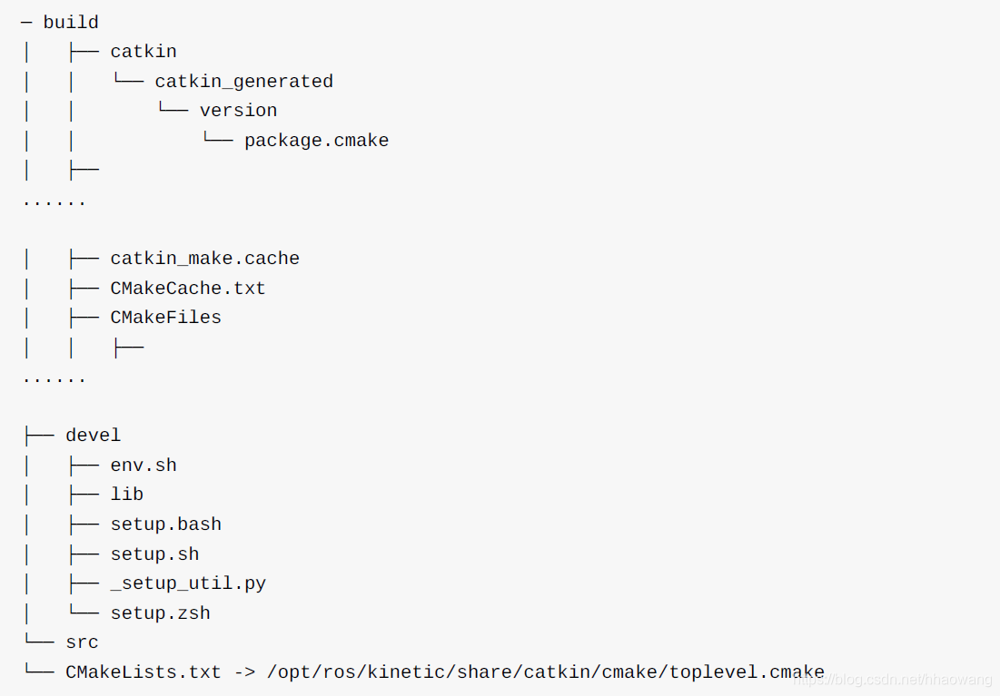

#### 3.6.5 package

package也是ROS源代码存放的地方，任何ROS的代码无论是C++还是Python都要放到package中，这样才能正常的编译和运行。

一个package可以编译出来多个目标文件（ROS可执行程序、动态静态库、头文件等等）。

##### 3.6.5.1 package结构


##### 3.6.5.2 package指令


#### 3.6.6 常见问题

点进源代码包后，把`build/devel`两个包删了，在当前路径下进入终端

```
catkin_make
```

如果没有error，记得source配置环境，编译成功‘

以下是一些问题现象和解决方案

**问题①**

```
CMake Error at /opt/ros/noetic/share/catkin/cmake/catkinConfig.cmake:83 (find_package): Could not find a package configuration file provided by "catkin_virtualenv" with any of the following names:

    catkin_virtualenvConfig.cmake
    catkin_virtualenv-config.cmake
  Invoking "make cmake_check_build_system" failed
```

这是由于缺少包导致的

**解决方案：**

在终端输入：

```
sudo apt-get install ros-noetic-catkin-virtualenv
```

注意：

1.error里面”_”下划线在解决代码里面用“-”分割符号

2.Ubuntu20.04是noetic        Ubuntu18.04是melodic

3.有可能缺少好几个包，catkin_make多编译几次再下载几次包

**问题②**

在下载的时候

```
E:无法定位到软件包
```

原因很多，网络连接问题、`ros`软件源、apt源过期等问题

**解决方案：**

查一遍list,这个很麻烦需要耐心，我没试过谨慎试

换源镜像

http://t.csdnimg.cn/o9dce

### 3.7 SLAM四种算法建图对比

> Contributors: 洪佳

> 参考文献：
>
> [12] [2D激光slam四种算法建图效果对比_slam建图算法-CSDN博客 - https://blog.csdn.net/](https://blog.csdn.net/m0_73791170/article/details/127339058?csdn_share_tail={"type"%3A"blog"%2C"rType"%3A"article"%2C"rId"%3A"127339058"%2C"source"%3A"Hong_J_0826"}&fromshare=blogdetail)

SLAM——同步定位与建图（Simultaneous Localization and Mapping，SLAM）是在上世纪80年代被提出的，起初发展的算法皆采用激光雷达作为定位与建图的工具，随着稀疏性问题的解决，相机也被引入SLAM领域，如今SLAM技术在向多传感器融合的方向发展，激光雷达、深度相机、IMU惯导等正成为SLAM技术的常见解决方案。

#### 3.7.1 Gmapping

一种用于建立**二维地图的概率算法**，它基于激光雷达数据和机器人的运动信息，通过**蒙特卡洛方法**进行粒子滤波定位和地图构建。

这个部分写得详细一点，因为我们比赛建图使用的就是`Gmapping`算法,从理论到实际

（后面三种实际操作暂无，为了统一，参考构建地图都来自一篇文章）

##### 3.7.1.1 概述

其算法框架是基于RBPF粒子滤波算法，先进行定位再进行建图

RBPF：http://t.csdnimg.cn/h4PfS，对于建图而言，简单来说就是通过算法迭代，在粒子群中选出最优粒子，使用激光雷达数据和所关联的历史轨迹来绘制地图。其**定位和建图是分离的**，每个粒子都携带它们自身的地图（不适合大场地建图，但是我们比赛场地面积用`Gmapping`建图问题不大）。

|           RBPF问题           |            `Gmapping`改进            |
| :--------------------------: | :----------------------------------: |
| 粒子多——计算量大、内存消耗大 | 改进提议分布（考虑里程计、观测信息） |
|      频繁执行——粒子退化      |       选择性重采样（设定阈值）       |

##### 3.7.1.2 优缺点

- 优点

`Gmapping`可以实时构建室内地图，在构建小场景地图所需的计算量较小且精度较高。相比Hector SLAM对激光雷达频率要求低、鲁棒性高.

而相比Cartographer在构建小场景地图时，`Gmapping`不需要太多的粒子并且没有回环检测因此计算量小于Cartographer而精度并没有差太多。`Gmapping`有效利用了车轮里程计信息，这也是`Gmapping`对激光雷达频率要求低的原因：里程计可以提供机器人的位姿先验。而Hector和Cartographer的设计初衷不是为了解决平面移动机器人定位和建图，Hector主要用于救灾等地面不平坦的情况，因此无法使用里程计。而Cartographer是用于手持激光雷达完成SLAM过程，也就没有里程计可以用。

- 缺点

随着场景增大所需的粒子增加，因为每个粒子都携带一幅地图，因此在构建大地图时所需内存和计算量都会增加。因此不适合构建大场景地图。

没有**回环检测**(http://t.csdnimg.cn/8Vh3X)，因此在回环闭合时可能会造成地图错位，虽然增加粒子数目可以使地图闭合但是以增加计算量和内存为代价。所以不能像Cartographer那样构建大的地图。

`Gmapping`和Cartographer一个是基于滤波框架SLAM另一个是基于优化框架的SLAM，两种算法都涉及到时间复杂度和空间复杂度的权衡。`Gmapping`牺牲空间复杂度保证时间复杂度，这就造成`mapping`不适合构建大场景地图。翻看Cartographer算法，优化相当于地图中只用一个粒子，因此存储空间比较`Gmapping`会小很多倍，但计算量大;优化图需要复杂的矩阵运算。

##### 3.7.1.3 建图实操

1)软硬件准备：

`rplidar`及其驱动；navigation和`gmapping`等package;`tf`变换关系

很多开源的相关功能包，这是SLAM导航核心技术的内容，随便查

编译功能包，使系统识别ROS工作空间

下载`gmapping`·是为了能够在自己的小车运行，因此必须按照小车的实际情`gmapping`算法中的**参数进行配置**

```
touch gmapping_robot.launch
```

2)笔记本和主控板连接

这个步骤看情况，直接接显示屏或者看小屏也可以

可以`ssh`远程操控，使用`Nomachine`等工具

3)操作指令

```
roslaunch turn_on_什么机器人 mapping.launch  //建图命令
rviz     //可视化
roslaunch  机器人 keyboard_teleop.launch   //控制命令
roslaunch turn_on_什么机器人 map_saver.launch   //保存地图
```

**注意：在单独启动rviz时，需要先启动master节点：`roscore`，然后另启一终端运行：`rosrun rviz rviz`。但是对.launch文件，运行之后，若master节点没有启动会自动去启动它，因此在第二步运行rviz时，master节点已经被启动了，无需再次运行`roscore`。
每次打开rviz都要重新配置很麻烦，可以使用ctrl+s命令保存当前配置，保存到路径`opt/ros/melodic/share/rviz/default.rviz`，若提示无法写入该文件，则是当前文件权限为“only read”，启动一个终端，输入并运行命令`sudo chmod 777 /opt/ros/melodic/share/rviz/default.rviz`，然后再此尝试`ctrl+s`保存即可成功**


4)灰度地图和代价地图

建图得到**灰度地图**，其数值范围为[-1,100]，其中“-1”代表未知区域，基本是`rviz`的背景色，“0“代表自由区域，为白色，”100“代表完全占用，为黑色，实际上在建图时只有”-1“、”0“、”100“三种情况，因为建图过程中雷达探测到了障碍物一般就是确定的，不会取0-100之间的数值。

到了执行导航功能时，系统的地图又有所不同，此时使用的并不完全是使用建图的地图，而是使用代价地图。代价地图的取值范围是[0,254]，数值越大，表示占用程度越高，导航时小车越要远离。

代价地图的生成过程可以参考此文章：https://blog.csdn.net/qq_35635374/article/details/120874817（到了导航部分再细说），总而言之就是对之前建好的静态层地图和雷达运行探测到的障碍层地图按照膨胀规则进行膨胀和合并，生成数值在[0,254]之间的代价地图，导航时按照地图方格中的数值进行路径规划

#### 3.7.2 Hector

`Hector`算法框架是基于高斯牛顿
（Hector 在机器人快速转向时很容易发生错误匹配，建出的地图发生错位，原因主要是优化算法容易陷入局部最小值）

优点：不需要里程计，适应于空中或者路面不平坦的环境

缺点：旋转过快易发生漂移，无回环检测


#### 3.7.3 Karto

`Karto`算法框架是基于图优化

优点：这是首个基于图优化的开源算法，利用高度优化和非迭代平方根法分解从而进行稀疏化解耦求解

缺点：无法实时构建子图，耗费时间

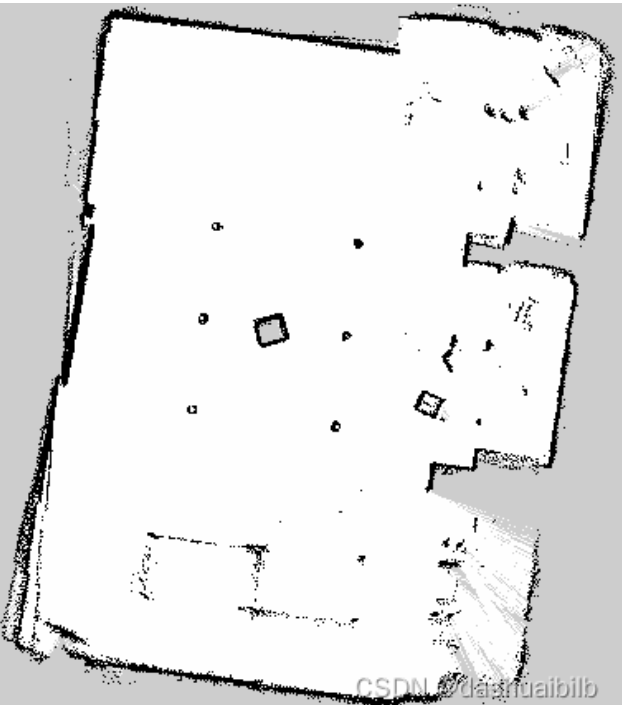

#### 3.7.4 Cartographer

`Cartographer`算法框架是基于图优化cartographer在不同环境下，调整参数和传感器配置，就能工作
大部分数据集，cartographer表现更优。ActiveSubmaps2D类中的submaps_列表实际最多只两个submap，一个认为是old_map，另一个认为是new_map，类似于滑窗操作。

当new_map插入激光scan的个数达到阈值时，则会将old_map进行结束，并且不再增加新的scan。同时将old_map进行删除，将new_map作为`oldmap`，然后重新初始化一个新的submap作为`newmap`。其具体实现可看代码注解，较为简单。首先回环优化，我们需要检测到回环，再进行优化。如何检测回环呢，前文也提到过，如果当前的scan和所有已创建完成的submap中的某个laser scan的位姿在距离上足够近，那么通过某种 scan match策略就会找到该闭环。

这里为了减少计算量，提高实时回环检测的效率，Cartographer应用了branch and bound(分支定界)优化方法进行优化搜索，如果得到一个足够好的匹配，到此处，回环检测部分已经结束了，已经检测到了回环得存在。接下来要根据当前scan的位姿和匹配到得最接近的submap中的某一个位姿来对所有的submap中的位姿进行优化，即使残差E最小。

优点：适应于低成本激光雷达，加速回环检测，实时性强

缺点：在几何对称环境中，易回环出错


### 3.8 cmake

#### 3.8.1 常见问题

1.`target_compile_definitions` 的宏定义内容在VSCode编辑器中中无法识别

**解决方案**

在 `.vscode/c_cpp_properties.json` 中新增下列参数

参考自 [Stack Overflow](https://stackoverflow.com/questions/74397633/vscode-intellisense-cannot-understand-cmake-add-definitions)

```json
{
    "configurations": [
        {
            "compileCommands": "${workspaceFolder}/build/compile_commands.json"
        }
    ],
}
```


<div STYLE="page-break-after: always;"></div>

## 4 文档编写

> Contributors: 叶睿聪 (dgsyrc@github)、洪佳

> 参考文献：
>
> [3] [【Typora 教程】手把手教你如何用Typora撰写笔记](https://www.bilibili.com/video/BV1h84y1Y7nn/?vd_source=436470546f64e53b7d4516956091ffd7)

软件：Typora

以Typora编辑器以及Mardown+latex语法为例

### 4.1 标题

>语法：# (一级标题)  ## (二级标题)  ### (三级标题) ......

>代码：
>
>```text
># 这是一级标题
>## 这是二级标题
>```

>效果:  
>
># 这是一级标题
>
>## 这是二级标题

>快捷键:
>
>* Ctrl+数字1~6可以快速将选中的文本调成对应级别的标题
>* Ctrl+0可以快速将选中的文本调成普通文本
>* Ctrl+加号/减号对标题级别进行加减

### 4.2 分割线

>语法:  ---或者***+回车

>代码:
>
>```text
>---或者***
>```

>效果:

-----

注意：*会自动补全另一个，字体显示不一致*；减号三个即可

### 4.3 文字显示

#### 4.3.1 字体

>语法:
>
>* 粗体:  用一对双星号包裹
>* 删除线:  用一对双飘号包裹
>* 下划线:  用一对u标签包裹
>* 斜体:  用一对单星号包裹
>* 高亮:  用一对双等号包裹

>代码:
>
>```text
>**这是粗体**
>~~这是删除线~~
><u>这是下划线</u>
>*这是斜体*
>==这是高亮==
>```

>效果:
>**这是粗体**
>~~这是删除线~~
><u>这是下划线</u>
>*这是斜体*
>==这是高亮==

>快捷键:
>
>* 加粗:  Ctrl+B
>* 删除线:  Shift+Alt+5
>* 下划线:  Ctrl+U
>* 斜体:  Ctrl+I

#### 4.3.2 上下标

>代码:
>
>```text
>x^2^
>H~2~O
>```

>效果:
>x^2^
>H~2~O

### 4.4 列表

#### 4.4.1 无序列表

>代码:
>
>```text
>*/-/+ +空格
>```

>效果:
>1.只有同一级别:
>
>* 苹果
>* 香蕉
>* 橘子
>
>2.子集类:
>
>* 一级分类
>  * 二级分类 
>    * 三级分类

>快捷键:  Ctrl+Shift+]

#### 4.4.2 有序列表

>代码:
>
>```text
>数字+.+空格
>```

>效果:
>
>1. 第一个标题
>2. 第二个标题
>3. 第三个标题
>
>   * 子内容1
>     * 子内容2
>4. 第四个标题

>快捷键:  Ctrl+Shift+[

#### 4.4.3 任务列表

>代码:
>
>```text
>- [ ] 吃早餐
>- [x] 背单词
>```

>效果:
>
>- [ ] 吃早餐
>- [x] 背单词

### 4.5 区块显示

>代码:
>
>```text
>>+回车
>```

>效果:
>
>>这是最外层区块
>
>>>这是内层区块
>
>>>>这是最内层区块

### 4.6 代码显示

#### 4.6.1 行内代码

代码：

```
`sudo rm -rf /*`
```

`sudo rm -rf /*`

>快捷键:  Ctrl+Shift+`

#### 4.6.2 代码块

点击代码块可以选择代码语言（要输入才会显示有什么选择），选择后会有代码高亮（也可以把语言标识写在第一行的三个点旁边以设置语言）

如：cpp（即C++）、python、cmake等

~~~markdown
```
代码块
```
~~~

例如C++代码：

````markdown
```cpp
代码块
```
````

代码高亮效果：

```cpp
#include<iostream>
using namespace std;

int main()
{
    cout << "Hello World!" << endl;
    return 0;
}
```

>快捷键:  Ctrl+Shift+K

### 4.7 链接

>代码:
>
>```text
>www.baidu.com
>[百度一下](https://www.baidu.com)
>[百度一下](https://www.baidu.com "https://www.baidu.com")
>```

>效果:
>www.baidu.com
>[百度一下](https://www.baidu.com)
>[百度一下](https://www.baidu.com "https://www.baidu.com")

>快捷键:  Ctrl+K

### 4.8 脚注

>说明:  对文本进行解释说明。

>代码: 
>
>```text
>[^文本]
>[^文本]:解释说明
>```

>应用:
>这是一个技术\[^①\]
>
>\[^①\]: 这是一个非常好用的框架。

实际效果为在文本后显示^后的文本

点击该文本后会跳转至文档最末尾并列出`[^①]:` 后内容

### 4.9 图片插入

```markdown

```

如：

```markdown

```


>快捷键:  Ctrl+Shift+I

### 4.10 表格

>代码:
>
>```text
>|  1   |  2   |  3   |
>| :--- | :--: | ---: |
>|  4   |  5   |  6   |
>|  7   |  8   |  9   |
>|  10  |  11  |  12  |
>```

>效果:
>
>| 1    |  2   |    3 |
>| ---- | :--: | ---: |
>| 4    |  5   |    6 |
>| 7    |  8   |    9 |
>| 10   |  11  |   12 |

>快捷键:  Ctrl+T

### 4.11 流程图

#### 4.11.1 横向流程图

> 代码:
>
> ````text
> ```mermaid
> graph LR
> A[方形]==>B(圆角)
> B==>C{条件a}
> C-->|a=1|D[结果1]
> C-->|a=2|E[结果2]
> F[横向流程图]
> ```
> ````

>效果:
>
>```mermaid
>graph LR
>A[方形]==>B(圆角)
>B==>C{条件a}
>C-->|a=1|D[结果1]
>C-->|a=2|E[结果2]
>F[横向流程图]
>```

#### 4.11.2 竖向流程图

> 代码:
>
> ````text
> ```mermaid
> graph TD
> A[方形]==>B(圆角)
> B==>C{条件a}
> C-->|a=1|D[结果1]
> C-->|a=2|E[结果2]
> F[竖向流程图]
> ```
> ````

>效果:
>
>```mermaid
>graph TD
>A[方形]==>B(圆角)
>B==>C{条件a}
>C-->|a=1|D[结果1]
>C-->|a=2|E[结果2]
>F[竖向流程图]
>```

### 4.12 表情符号

>代码:
>
>```text
>:happy:、:cry:、:man:
>```

>效果:
>:happy:、 :cry:、 :man:

### 4.13 数学公式（Latex）

#### 4.13.1 公式的插入

**①行中公式**

>代码:
>
>```text
>$公式$
>```

>效果:
>$公式$

**②独立公式**

>代码:
>
>```text
>$$
>公式
>$$
>```

>效果:
>$$
>公式
>$$

#### 4.13.2 上下标

>代码:
>
>```text
>$x^{y^z}=(1+e^x)^{-2xy^w}$
>$\sideset{^1_2}{^3_4}{\underset{6}\bigotimes}$
>```

>效果:
>$x^{y^z}=(1+e^x)^{-2xy^w}$
>$\sideset{^1_2}{^3_4}{\underset{6}\bigotimes}$

#### 4.13.3 括号和分隔符

>代码:
>
>```text
>$\langle\quad\rangle\quad\lceil\quad\rceil\quad\lfloor\quad\rfloor\quad\lbrace\quad\rbrace\quad\lVert\quad\rVert$
>$f(x,y,z)=3y^2z\left(3+\dfrac{7x+5}{1+y^2}\right)$
>$\left.\dfrac{\mathrm{d}u}{\mathrm{d}x}\right|_{x=0}$
>```

>效果:
>$\langle\quad\rangle\quad\lceil\quad\rceil\quad\lfloor\quad\rfloor\quad\lbrace\quad\rbrace\quad\lVert\quad\rVert$
>$f(x,y,z)=3y^2z\left(3+\dfrac{7x+5}{1+y^2}\right)$
>$\left.\dfrac{\mathrm{d}u}{\mathrm{d}x}\right|_{x=0}$

#### 4.13.4 分数

>代码:
>
>```text
>$\frac{a}{b}\quad\dfrac{a}{b}\quad {a\over b}$
>```

>效果:
>$\frac{a}{b}\quad\dfrac{a}{b}\quad {a\over b}$

#### 4.13.5 开方

>代码:
>
>```text
>$\sqrt[根指数,省略时为2]{被开方数}$
>```

>效果:
>$\sqrt{2}\quad\sqrt[3]{2}$

#### 4.13.6 省略号

>代码:
>
>```text
>$\cdots\quad\ldots\quad\vdots\quad\ddots$
>```

>效果:
>$\cdots\quad\ldots\quad\vdots\quad\ddots$

#### 4.13.7 矢量和均值

>代码:
>
>```text
>$\overrightarrow{E(\vec{r})}\quad\overleftarrow{E(\vec{r})}\quad\overleftrightarrow{E(\vec{r})}\quad\underrightarrow{E(\vec{r})}\quad\underleftarrow{E(\vec{r})}\quad\underleftrightarrow{E(\vec{r})}\quad\overline{v}=\bar{v}\quad\underline{v}$
>```

>效果:
>$\overrightarrow{E(\vec{r})}\quad\overleftarrow{E(\vec{r})}\quad\overleftrightarrow{E(\vec{r})}\quad\underrightarrow{E(\vec{r})}\quad\underleftarrow{E(\vec{r})}\quad\underleftrightarrow{E(\vec{r})}\quad\overline{v}=\bar{v}\quad\underline{v}$

#### 4.13.8 积分

>代码:
>
>```text
>$$
>\iint\limits_D\left(\dfrac{\partial Q}{\partial x}-\dfrac{\partial P}{\partial y}\right){\rm d}x{\rm d}y=\oint\limits_LP{\rm d}x+Q{\rm d}y
>$$
>```

>效果:
>$$
>\iint\limits_D\left(\dfrac{\partial Q}{\partial x}-\dfrac{\partial P}{\partial y}\right){\rm d}x{\rm d}y=\oint\limits_LP{\rm d}x+Q{\rm d}y
>$$

#### 4.13.9 极限

>代码:
>
>```text
>$\lim\limits_{n\to\infin}(1+\dfrac{1}{n})^n=e$
>```

>效果:
>$\lim\limits_{n\to\infin}(1+\dfrac{1}{n})^n=e$

#### 4.13.10 累加、累乘及交集、并集

>```text
>$\sum\limits_{i=1}^n\dfrac{1}{n^2}\quad and\quad\prod\limits_{i=1}^n\dfrac{1}{n^2}\quad and\quad\bigcup\limits_{i=1}^n\dfrac{1}{n^2}\quad and\quad\bigcap\limits_{i=1}^n\dfrac{1}{n^2}$
>```

>效果:
>$\sum\limits_{i=1}^n\dfrac{1}{n^2}\quad and\quad\prod\limits_{i=1}^n\dfrac{1}{n^2}\quad and\quad\bigcup\limits_{i=1}^n\dfrac{1}{n^2}\quad and\quad\bigcap\limits_{i=1}^n\dfrac{1}{n^2}$

#### 4.13.11 希腊字母

| 语法                          | 字母                            | 语法                    | 字母                      | 语法               | 字母                 |
| :---------------------------- | ------------------------------- | ----------------------- | ------------------------- | ------------------ | -------------------- |
| \Alpha(\alpha)                | $\Alpha(\alpha)$                | \Beta(\beta)            | $\Beta(\beta)$            | \Gamma(\gamma)     | $\Gamma(\gamma)$     |
| \Epsilon(\epsilon)\varepsilon | $\Epsilon(\epsilon)\varepsilon$ | \Zeta(\zeta)            | $\Zeta(\zeta)$            | \Eta(\eta)         | $\Eta(\eta)$         |
| \Iota(\iota)                  | $\Iota(\iota)$                  | \Kappa(\kappa)\varkappa | $\Kappa(\kappa)\varkappa$ | \Lambda(\lambda)   | $\Lambda(\lambda)$   |
| \Nu(\nu)                      | $\Nu(\nu)$                      | \Xi(\xi)                | $\Xi(\xi)$                | \Omicron(\omicron) | $\Omicron(\omicron)$ |
| \Rho(\rho)\varrho             | $\Rho(\rho)\varrho$             | \Sigma(\sigma)\varsigma | $\Sigma(\sigma)\varsigma$ | \Tau(\tau)         | $\Tau(\tau)$         |
| \Phi(\phi)\varphi             | $\Phi(\phi)\varphi$             | \Chi(\chi)              | $\Chi(\chi)$              | \Psi(\psi)         | $\Psi(\psi)$         |
| \Delta(\delta)                | $\Delta(\delta)$                | \Theta(\theta)\vartheta | $\Theta(\theta)\vartheta$ | \Mu(\mu)           | $\Mu(\mu)$           |
| \Pi(\pi)\varpi                | $\Pi(\pi)\varpi$                | \Omega(\omega)          | $\Omega(\omega)$          | \upsilon           | $\upsilon$           |
| \ell                          | $\ell$                          | \eth                    | $\eth$                    | \hbar              | $\hbar$              |
| \hslash                       | $\hslash$                       | \mho                    | $\mho$                    | \partial           | $\partial$           |

#### 4.13.12 特殊字符

**①说明**

>可以在字符前使用`\large`或`\small`以显示更大或更小的字符。${\LARGE A}{\Large A}{\large A}A{\small A}$

**②关系运算符**

| 输入      | 显示        | 输入              | 显示                | 输入         | 显示         |
| --------- | ----------- | ----------------- | ------------------- | ------------ | ------------ |
| \pm(\mp)  | $\pm(\mp)$  | \times            | $\times$            | \div         | $\div$       |
| \nmid     | $\nmid$     | \cdot             | $\cdot$             | \mid         | $\mid$       |
| \bigodot  | $\bigodot$  | \bigotimes        | $\bigotimes$        | \bigoplus    | $\bigoplus$  |
| \ge       | $\ge$       | \le               | $\le$               | \ll          | $\ll$        |
| \geqslant | $\geqslant$ | \leqslant         | $\leqslant$         | \neq         | $\neq$       |
| \approx   | $\approx$   | \xlongequal{文本} | $\xlongequal{文本}$ | \triangleq   | $\triangleq$ |
| \sim      | $\sim$      | \doteq            | $\doteq$            | \equiv       | $\equiv$     |
| \cong     | $\cong$     | \propto           | $\propto$           | \parallel(\\ | )            |
| \prec     | $\prec$     | \pmod{2}          | $\pmod{2}$          | \bmod        | $\bmod{2}$   |

**③集合运算符**

| 输入      | 显示        | 输入        | 显示          | 输入       | 显示         |
| --------- | ----------- | ----------- | ------------- | ---------- | ------------ |
| \emptyset | $\emptyset$ | \varnothing | $\varnothing$ |            |              |
| \subset   | $\subset$   | \subseteq   | $\subseteq$   | \subsetneq | $\subsetneq$ |
| \supset   | $\supset$   | \supseteq   | $\supseteq$   | \supsetneq | $\supsetneq$ |
| \bigcap   | $\bigcap$   | \bigcup     | $\bigcup$     | \setminus  | $\setminus$  |
| \bigvee   | $\bigvee$   | \bigwedge   | $\bigwedge$   |            |              |
| \in       | $\in$       | \notin      | $\notin$      | \ni        | $\ni$        |

**④三角运算符**

| 输入    | 显示      | 输入 | 显示   | 输入   | 显示     |
| ------- | --------- | ---- | ------ | ------ | -------- |
| \circ   | $\circ$   | \bot | $\bot$ | \angle | $\angle$ |
| \degree | $\degree$ |      |        |        |          |

**⑤微积分运算符**

| 输入  | 显示    | 输入   | 显示     | 输入      | 显示     |
| ----- | ------- | ------ | -------- | --------- | -------- |
| \int  | $\int$  | \iint  | $\iint$  | \iiint    | $\iiint$ |
| \oint | $\oint$ | \oiint | $\oiint$ | \prime(‘) | $\prime$ |
| \lim  | $\lim$  | \infin | $\infin$ | \nabla    | $\nabla$ |

**⑥逻辑运算符**

| 输入     | 显示       | 输入       | 显示         | 输入   | 显示     |
| -------- | ---------- | ---------- | ------------ | ------ | -------- |
| \because | $\because$ | \therefore | $\therefore$ |        |          |
| \forall  | $\forall$  | \exist     | $\exist$     |        |          |
| \not>    | $\not>$    | \not<      | $\not<$      |        |          |
| \land    | $\land$    | \lor       | $\lor$       | \lnot  | $\lnot$  |
| \top     | $\top$     | \vdash     | $\vdash$     | \vDash | $\vDash$ |

**⑦带帽符号**

| 输入           | 显示             | 输入            | 显示              |
| -------------- | ---------------- | --------------- | ----------------- |
| \hat{xy}       | $\hat{xy}$       | \widehat{xyz}   | $\widehat{xyz}$   |
| \tilde{xy}     | $\tilde{xy}$     | \widetilde{xyz} | $\widetilde{xyz}$ |
| \check{x}      | $\check{x}$      | \breve{y}       | $\breve{y}$       |
| \grave{x}      | $\grave{x}$      | \acute{y}       | $\acute{y}$       |
| \dot{x}        | $\dot{x}$        | \ddot{x}        | $\ddot{x}$        |
| \overparen{xy} | $\overparen{xy}$ |                 |                   |

**⑧选取符号**

| 输入                           | 显示                             | 输入                            | 显示                              |
| ------------------------------ | -------------------------------- | ------------------------------- | --------------------------------- |
| \fbox{a+b+c+d}                 | $\fbox{a+b+c+d}$                 |                                 |                                   |
| \overbrace{xx\cdots x}^{10个x} | $\overbrace{xx\cdots x}^{10个x}$ | \underbrace{xx\cdots x}_{10个x} | $\underbrace{xx\cdots x}_{10个x}$ |

**⑨箭头符号**

| 输入           | 显示             | 输入              | 显示                | 输入                | 显示                  |
| -------------- | ---------------- | ----------------- | ------------------- | ------------------- | --------------------- |
| \leftarrow     | $\leftarrow$     | \rightarrow       | $\rightarrow$       | \leftrightarrow     | $\leftrightarrow$     |
| \longleftarrow | $\longleftarrow$ | \longrightarrow   | $\longrightarrow$   | \longleftrightarrow | $\longleftrightarrow$ |
| \Leftarrow     | $\Leftarrow$     | \Rightarrow       | $\Rightarrow$       | \Leftrightarrow     | $\Leftrightarrow$     |
| \Longleftarrow | $\Longleftarrow$ | \Longrightarrow   | $\Longrightarrow$   | \Longleftrightarrow | $\Longleftrightarrow$ |
| \uparrow       | $\uparrow$       | \downarrow        | $\downarrow$        | \updownarrow        | $\updownarrow$        |
| \Uparrow       | $\Uparrow$       | \Downarrow        | $\Downarrow$        | \Updownarrow        | $\Updownarrow$        |
| \to            | $\to$            | \swarrow          | $\swarrow$          | \nearrow            | $\nearrow$            |
| \gets          | $\gets$          | \searrow          | $\searrow$          | \nwarrow            | $\nwarrow$            |
| \mapsto        | $\mapsto$        | \rightrightarrows | $\rightrightarrows$ |                     |                       |

**⑩空格**

| 输入 | 效果   | 输入    | 效果   | 输入   | 效果       |
| ---- | ------ | ------- | ------ | ------ | ---------- |
| \\!  | $|\!|$ | 默认    | $||$   | \quad  | $|\quad|$  |
| \,   | $|\,|$ | \;(\\ ) | $|\;|$ | \qquad | $|\qquad|$ |

#### 4.13.13 字体

> 代码:
>
> ```text
> ${\字体{需要转换的字符}}$
> ```

| 输入 | 说明     | 显示            | 输入  | 说明       | 显示              |
| ---- | -------- | --------------- | ----- | ---------- | ----------------- |
| \rm  | 罗马体   | ${\rm{Sample}}$ | \cal  | 花体       | ${\cal{Sample}}$  |
| \it  | 意大利体 | ${\it{Sample}}$ | \Bbb  | 黑板粗体   | ${\Bbb{Sample}}$  |
| \bf  | 粗体     | ${\bf{Sample}}$ | \mit  | 数学斜体   | ${\mit{Sample}}$  |
| \sf  | 等线体   | ${\sf{Sample}}$ | \scr  | 手写体     | ${\scr{Sample}}$  |
| \tt  | 打字机体 | ${\tt{Sample}}$ | \frak | 旧德式字体 | ${\frak{Sample}}$ |

#### 4.13.14 大括号和行标

>说明:  使用`\left`和`\right`来创建自动匹配高度的`()`、`[]`、`{}`、`.`。在每个公式末尾使用`\tag{行标}`来实现行标。

>代码:
>
>```text
>$$
>f\left(
>\left[
>\dfrac{1+\{x,y\}}{\left(\dfrac{x}{y}+\dfrac{y}{x}\right)(u+1)}+a
>\right]
>^{\dfrac{3}{2}}
>\right)
>\tag{行标}
>$$
>```

>效果:
>$$
>f\left(\left[\dfrac{1+\{x,y\}}{\left(\dfrac{x}{y}+\dfrac{y}{x}\right)(u+1)}+a\right]^{\dfrac{3}{2}}\right)\tag{行标}
>$$

>说明:如果你想将行内显示的分隔符也变大,也可以使用`\middle`命令

>代码:
>
>```text
>$$
>\left\langle q\middle\|\dfrac{\dfrac{x}{y}}{\dfrac{u}{v}}\middle|p\right\rangle
>$$
>```

>效果:
>$$
>\left\langle q\middle\|\dfrac{\dfrac{x}{y}}{\dfrac{u}{v}}\middle|p\right\rangle
>$$

#### 4.13.15 其他命令

**①注释文字**

>代码:
>
>```text
>$\text{文字}$
>```

>效果:
>$$
>f(n)=\begin{cases}n/2,&\text{if $n$ is even}\\3n+1,&\text{if $n$ is odd}\end{cases}
>$$

**③文字颜色**

>* 适用新旧浏览器
>  代码:
>
>```text
>$\color{颜色}{文字}$
>```

| 输入    | 显示                     | 输入   | 显示                    | 输入   | 显示                    |
| ------- | ------------------------ | ------ | ----------------------- | ------ | ----------------------- |
| black   | $\color{black}{color}$   | grey   | $\color{grey}{color}$   | silver | $\color{silver}{color}$ |
| white   | $\color{white}{color}$   | maroon | $\color{maroon}{color}$ | red    | $\color{red}{color}$    |
| yellow  | $\color{yellow}{color}$  | lime   | $\color{lime}{color}$   | olive  | $\color{olive}{color}$  |
| green   | $\color{green}{color}$   | teal   | $\color{teal}{color}$   | auqa   | $\color{auqa}{color}$   |
| blue    | $\color{blue}{color}$    | navy   | $\color{navy}{color}$   | purple | $\color{purple}{color}$ |
| fuchsia | $\color{fuchsia}{color}$ |        |                         |        |                         |

>* 适用新版浏览器
>  代码:
>
>```text
>$\color{#rgb}{文字}$    (注:其中r、g、b可以输入0~9和a~f来分别表示红色、绿色和蓝色的纯度)
>```

| 输入 | 输出                  | 输入 | 输出                  | 输入 | 输出                  | 输入 | 输出                  |
| ---- | --------------------- | ---- | --------------------- | ---- | --------------------- | ---- | --------------------- |
| #000 | $\color{#000}{color}$ | #005 | $\color{#005}{color}$ | #00A | $\color{#00A}{color}$ | #00F | $\color{#00F}{color}$ |
| #500 | $\color{#500}{color}$ | #505 | $\color{#505}{color}$ | #50A | $\color{#50A}{color}$ | #50F | $\color{#50F}{color}$ |
| #A00 | $\color{#A00}{color}$ | #A05 | $\color{#A05}{color}$ | #A0A | $\color{#A0A}{color}$ | #A0F | $\color{#A0F}{color}$ |
| #F00 | $\color{#F00}{color}$ | #F05 | $\color{#F05}{color}$ | #F0A | $\color{#F0A}{color}$ | #F0F | $\color{#F0F}{color}$ |
| #050 | $\color{#050}{color}$ | #055 | $\color{#055}{color}$ | #05A | $\color{#05A}{color}$ | #05F | $\color{#05F}{color}$ |
| #550 | $\color{#550}{color}$ | #555 | $\color{#555}{color}$ | #55A | $\color{#55A}{color}$ | #55F | $\color{#55F}{color}$ |
| #A50 | $\color{#A50}{color}$ | #A55 | $\color{#A55}{color}$ | #A5A | $\color{#A5A}{color}$ | #A5F | $\color{#A5F}{color}$ |
| #F50 | $\color{#F50}{color}$ | #F55 | $\color{#F55}{color}$ | #F5A | $\color{#F5A}{color}$ | #F5F | $\color{#F5F}{color}$ |
| #0A0 | $\color{#0A0}{color}$ | #0A5 | $\color{#0A5}{color}$ | #0AA | $\color{#0AA}{color}$ | #0AF | $\color{#0AF}{color}$ |
| #5A0 | $\color{#5A0}{color}$ | #5A5 | $\color{#5A5}{color}$ | #5AA | $\color{#5AA}{color}$ | #5AF | $\color{#5AF}{color}$ |
| #AA0 | $\color{#AA0}{color}$ | #AA5 | $\color{#AA5}{color}$ | #AAA | $\color{#AAA}{color}$ | #AAF | $\color{#AAF}{color}$ |
| #FA0 | $\color{#FA0}{color}$ | #FA5 | $\color{#FA5}{color}$ | #FAA | $\color{#FAA}{color}$ | #FAF | $\color{#FAF}{color}$ |
| #0F0 | $\color{#0F0}{color}$ | #0F5 | $\color{#0F5}{color}$ | #0FA | $\color{#0FA}{color}$ | #0FF | $\color{#0FF}{color}$ |
| #5F0 | $\color{#5F0}{color}$ | #5F5 | $\color{#5F5}{color}$ | #5FA | $\color{#5FA}{color}$ | #5FF | $\color{#5FF}{color}$ |
| #AF0 | $\color{#AF0}{color}$ | #AF5 | $\color{#AF5}{color}$ | #AFA | $\color{#AFA}{color}$ | #AFF | $\color{#AFF}{color}$ |
| #FF0 | $\color{#FF0}{color}$ | #FF5 | $\color{#FF5}{color}$ | #FFA | $\color{#FFA}{color}$ | #FFF | $\color{#FFF}{color}$ |

**③删除线**

>说明:  使用`\require{cancle}`声明，再使用`\cancle{字符}`、`\bcancle{字符}`、`\xcancle{字符}`、`\cancleto{字符}{字符}`来实现各种**片段删除线**效果。

>代码:
>
>```text
>$$
>\require{cancel}\begin{array}{r1}
>\verb|y+\cancel{x}|&y+\cancel{x}\\
>\verb|y+\cancel{y+x}|&y+\cancel{y+x}\\
>\verb|y+\bcancel{x}|&y+\bcancel{x}\\
>\verb|y+\xcancel{x}|&y+\xcancel{x}\\
>\verb|y+\cancelto{0}{x}|&y+\cancelto{0}{x}\\
>\verb+\frac{1\cancel9}{\cancel95}=\frac15+&\frac{1\cancel9}{\cancel95}=\frac15\\
>\end{array}
>$$
>```

>效果:
>$$
>\require{cancel}\begin{array}{r1}
>\verb|y+\cancel{x}|&y+\cancel{x}\\
>\verb|y+\cancel{y+x}|&y+\cancel{y+x}\\
>\verb|y+\bcancel{x}|&y+\bcancel{x}\\
>\verb|y+\xcancel{x}|&y+\xcancel{x}\\
>\verb|y+\cancelto{0}{x}|&y+\cancelto{0}{x}\\
>\verb+\frac{1\cancel9}{\cancel95}=\frac15+&\frac{1\cancel9}{\cancel95}=\frac15\\
>\end{array}
>$$

>说明:  使用`\require{enclose}`来允许**整段删除线**的显示，再使用`\enclose{删除线效果}{字符}`来使用各种整段删除线效果。其中，删除线效果有`horizontalstrike`、`verticalstrike`、`updiagonalstrike`和`downdiagonalstrike`,可以叠加使用。

>代码:
>
>```text
>$$
>\require{enclose}\begin{array}{r1}
>\verb|\enclose{horizontalstrike}{x+y}|&\enclose{horizontalstrike}{x+y}\\
>\verb|\enclose{verticalstrike}{\frac xy}|&\enclose{verticalstrike}{\frac xy}\\
>\verb|\enclose{updiagonalstrike}{x+y}|&\enclose{updiagonalstrike}{x+y}\\
>\verb|\enclose{downdiagonalstrike}{x+y}|&\enclose{downdiagonalstrike}{x+y}\\
>\verb|\enclose{horizontalstrike,updiagonalstrike}{x+y}|&\enclose{horizontalstrike,updiagonalstrike}{x+y}\\
>\end{array}
>$$
>```

>效果:
>$$
>\require{enclose}\begin{array}{r1}
>\verb|\enclose{horizontalstrike}{x+y}|&\enclose{horizontalstrike}{x+y}\\
>\verb|\enclose{verticalstrike}{\frac xy}|&\enclose{verticalstrike}{\frac xy}\\
>\verb|\enclose{updiagonalstrike}{x+y}|&\enclose{updiagonalstrike}{x+y}\\
>\verb|\enclose{downdiagonalstrike}{x+y}|&\enclose{downdiagonalstrike}{x+y}\\
>\verb|\enclose{horizontalstrike,updiagonalstrike}{x+y}|&\enclose{horizontalstrike,updiagonalstrike}{x+y}\\
>\end{array}
>$$

#### 4.13.16 矩阵

**①无框矩阵**

>代码:
>
>```text
>$$
>\begin{matrix}
>1&x&x^2\\
>1&y&y^2\\
>1&z&z^2\\
>\end{matrix}
>$$
>```

>效果:
>$$
>\begin{matrix}
>1&x&x^2\\
>1&y&y^2\\
>1&z&z^2\\
>\end{matrix}
>$$

**②边框矩阵**

>说明:  在开头将`matrix`替换为`pmatrix`、`bmatrix`、`Bmatrix`、`vmatrix`、`Vmatrix`。

| matrix                               | pmatrix                                | bmatrix                                | Bmatrix                                | vmatrix                                | Vmatrix                                |
| ------------------------------------ | -------------------------------------- | -------------------------------------- | -------------------------------------- | -------------------------------------- | -------------------------------------- |
| $\begin{matrix}1&2\\3&4\end{matrix}$ | $\begin{pmatrix}1&2\\3&4\end{pmatrix}$ | $\begin{bmatrix}1&2\\3&4\end{bmatrix}$ | $\begin{Bmatrix}1&2\\3&4\end{Bmatrix}$ | $\begin{vmatrix}1&2\\3&4\end{vmatrix}$ | $\begin{Vmatrix}1&2\\3&4\end{Vmatrix}$ |

**③带分割线的矩阵**

>说明:  可以使用`cc|c`来在一个三列矩阵中插入分割线。

>代码:
>
>```text
>$$
>\left[
>\begin{array}{cc|c}
>1&2&3\\
>4&5&6
>\end{array}
>\right]
>$$
>```

>效果:
>$$
>\left[
>\begin{array}{cc|c}
>1&2&3\\
>4&5&6
>\end{array}
>\right]
>$$

**④行中矩阵**

>代码:
>
>```text
>$\bigl(\begin{smallmatrix}a&b\\c&d\end{smallmatrix}\bigr)$
>```

>效果:
>$\bigl(\begin{smallmatrix}a&b\\c&d\end{smallmatrix}\bigr)$

#### 4.13.17 方程式序列

>说明:  可以使用`\begin{align}...\end{align}`来创建一列整齐且默认右对齐的方程式序列。请注意`{align}`是**自动编号**的，使用`{align*}`来声明停止自动编号，也可以使用`\notag`来取消特定行的自动编号。在需要的时候，你可以使用`\begin{equation}...\end{equation}`来强制表达式自动编号。

>代码:
>$$
>\begin{align}
>f(x)&=1+1\\
>&=2
>\end{align}
>$$
>
>$$
>\begin{equation}
>\left[
>\begin{array}{cc|c}
>1&2&3\\
>4&5&6
>\end{array}
>\right]
>\end{equation}
>$$
>
>
>
>```text
>$$
>\begin{align}
>\sqrt{37}=\sqrt{\dfrac{73^2-1}{12^2}}\\
>&=\sqrt{\dfrac{73^2}{12^2}\cdot\dfrac{73^2-1}{73^2}}\\
>&=\sqrt{\dfrac{73^2}{12^2}}\sqrt{\dfrac{73^2-1}{73^2}}\notag\\
>&=\dfrac{73}{12}\sqrt{1-\dfrac{1}{73^2}}\\
>\approx\dfrac{73}{12}\left(1-\dfrac{1}{2\cdot73^2}\right)\label{A}
>\end{align}
>$$
>***
>
>$$
>\begin{align*}
>v+m&=0&\text{Given}\tag1\\
>-w&=-w+0&\text{additive identity}\tag2\\
>-w+0&=-w+(v+w)&\text{equations $(1)$ and $(2)$}
>\end{align*}
>$$
>```

>效果:
>$$
>\begin{align}
>\sqrt{37}&=\sqrt{\dfrac{73^2-1}{12^2}}\\
>&=\sqrt{\dfrac{73^2}{12^2}\cdot\dfrac{73^2-1}{73^2}}\\
>&=\sqrt{\dfrac{73^2}{12^2}}\sqrt{\dfrac{73^2-1}{73^2}}\notag\\
>&=\dfrac{73}{12}\sqrt{1-\dfrac{1}{73^2}}\\
>&\approx\dfrac{73}{12}\left(1-\dfrac{1}{2\cdot73^2}\right)\label{A}
>\end{align}
>$$
>
>***
>
>$$
>\begin{align*}
>v+m&=0&\text{Given}\tag1\\
>-w&=-w+0&\text{additive identity}\tag2\\
>-w+0&=-w+(v+w)&\text{equations $(1)$ and $(2)$}
>\end{align*}
>$$
>
>你可以使用`\label{标签}`来创建一个标签，就如上面的方程式序列中展示的那样，之后使用`\eqref{标签}`引用你想引用的公式，效果为：$\eqref{A}$。如果不想要括号，可以输入`\ref{标签}`，效果为：公式 $\ref{A}$。
>
>公式1和2的不同列之间存在间隔，如果你不想要，可以通过将`align`替换为`alignat{1}`来去除列间隔。

#### 4.13.18 条件表达式

>说明:  使用`\begin{cases}`来创造一组默认左对齐的条件表达式,在每一行插入`&`来指定需要对齐的内容,并在每一行结尾处使用`\\`,以`\end{cases}`结尾。

>代码:
>
>```text
>$$
>f(n)=
>\begin{cases}
>n/2,&\text{if $n$ is even}\\
>3n+1,&\text{if $n$ is odd}
>\end{cases}
>$$
>```

>效果:
>$$
>f(n)=
>\begin{cases}
>n/2,&\text{if $n$ is even}\\
>3n+1,&\text{if $n$ is odd}
>\end{cases}
>$$

#### 4.13.19 配置行高

>说明:  可以使用`\\[2ex]`语句替代该行末尾的`\\`来让编译器适配 , 其中`[ex]`指一个"X-Height" , 即x字母高度 , 也可以使用`[3ex]`或`[4ex]`等。

>代码:
>
>```text
>$$
>f(n)=
>\begin{cases}
>\dfrac n2,&\text{if $n$ is even}\\[2ex]
>3n+1,&\text{if $n$ is odd}
>\end{cases}\tag{适配[2ex]}
>$$
>***
>
>$$
>f(n)=
>\begin{cases}
>\dfrac n2,&\text{if $n$ is even}\\
>3n+1,&\text{if $n$ is odd}
>\end{cases}\tag{不适配[2ex]}
>$$
>```

>效果:
>$$
>f(n)=
>\begin{cases}
>\dfrac n2,&\text{if $n$ is even}\\[2ex]
>3n+1,&\text{if $n$ is odd}
>\end{cases}\tag{适配[2ex]}
>$$
>
>***
>
>$$
>f(n)=
>\begin{cases}
>\dfrac n2,&\text{if $n$ is even}\\
>3n+1,&\text{if $n$ is odd}
>\end{cases}\tag{不适配[2ex]}
>$$

#### 4.13.20 数组与表格

>说明:  数组与表格均以`\begin{array}`开头,并在其后定义列数及每一列的文本对齐方式,`c` `l` `r`分别代表居中、左对齐及右对齐。若要插入垂直分割线，在定义中插入`|`，若要插入水平分割线，在定义中加入`\hline`。

>代码:
>
>```text
>$$
>\begin{array}{c|lcr}
>n&\text{左对齐}&\text{居中对齐}&\text{右对齐}\\
>\hline
>1&0.24&1&125\\
>2&-1&189&-8\\
>3&-20&2000&1+10i
>\end{array}
>$$
>```

>效果:
>$$
>\begin{array}{c|lcr}
>n&\text{左对齐}&\text{居中对齐}&\text{右对齐}\\
>\hline
>1&0.24&1&125\\
>2&-1&189&-8\\
>3&-20&2000&1+10i
>\end{array}
>$$

#### 4.13.21 嵌套表格或数组

>代码:
>
>```text
>$$
>% outer vertical array of arrays 外层垂直表格
>\begin{array}{c}
>% inner horizontal array of arrays 内层水平表格
>\begin{array}{cc}
>% inner array of minimum values 内层"最小值"数组
>\begin{array}{c|cccc}
>\text{min}&0&1&2&3\\
>\hline
>0&0&0&0&0\\
>1&0&1&1&1\\
>2&0&1&2&2\\
>3&0&1&2&3\\
>\end{array}
>&
>% inner array of maximum values 内层"最大值"数组
>\begin{array}{c|cccc}
>\text{max}&0&1&2&3\\
>\hline
>0&0&1&2&3\\
>1&1&1&2&3\\
>2&2&2&2&3\\
>3&3&3&3&3
>\end{array}
>\end{array}
>% 内层第一行表格组结束
>\\
>% inner array of delta values 内层第二行Delta值数组
>\begin{array}{c|cccc}
>\Delta&0&1&2&3\\
>\hline
>0&0&1&2&3\\
>1&1&0&1&2\\
>2&2&1&0&1\\
>3&3&2&1&0
>\end{array}
>% 内层第二行表格组结束
>\end{array}
>$$
>```

>效果:
>$$
>% outer vertical array of arrays 外层垂直表格
>\begin{array}{c}
>% inner horizontal array of arrays 内层水平表格
>\begin{array}{cc}
>% inner array of minimum values 内层"最小值"数组
>\begin{array}{c|cccc}
>\text{min}&0&1&2&3\\
>\hline
>0&0&0&0&0\\
>1&0&1&1&1\\
>2&0&1&2&2\\
>3&0&1&2&3\\
>\end{array}
>&
>% inner array of maximum values 内层"最大值"数组
>\begin{array}{c|cccc}
>\text{max}&0&1&2&3\\
>\hline
>0&0&1&2&3\\
>1&1&1&2&3\\
>2&2&2&2&3\\
>3&3&3&3&3
>\end{array}
>\end{array}
>% 内层第一行表格组结束
>\\
>% inner array of delta values 内层第二行Delta值数组
>\begin{array}{c|cccc}
>\Delta&0&1&2&3\\
>\hline
>0&0&1&2&3\\
>1&1&0&1&2\\
>2&2&1&0&1\\
>3&3&2&1&0
>\end{array}
>% 内层第二行表格组结束
>\end{array}
>$$

#### 4.13.22 方程组

>说明:  使用`\begin{array}...\end{array}`和`\left\{...\right.`来创建一个方程组,或者你也可以使用条件表达式组`\begin{cases}...\end{cases}`来实现相同效果。

>代码:
>
>```text
>$$
>\left\{
>\begin{array}{l}
>a_1x+b_1y+c_1z=d_1\\
>a_2x+b_2y+c_2z=d_2\\
>a_3x+b_3y+c_1z=d_3
>\end{array}
>\right.
>\quad\text{或者}\quad
>\begin{cases}
>a_1x+b_1y+c_1z=d_1\\
>a_2x+b_2y+c_2z=d_2\\
>a_3x+b_3y+c_1z=d_3
>\end{cases}
>$$
>```

>效果:
>$$
>\left\{
>\begin{array}{l}
>a_1x+b_1y+c_1z=d_1\\
>a_2x+b_2y+c_2z=d_2\\
>a_3x+b_3y+c_1z=d_3
>\end{array}
>\right.
>\quad\text{或者}\quad
>\begin{cases}
>a_1x+b_1y+c_1z=d_1\\
>a_2x+b_2y+c_2z=d_2\\
>a_3x+b_3y+c_1z=d_3
>\end{cases}
>$$

#### 4.13.23 连分式

>说明:  就像`\frac`一样,使用`\cfrac`或`\dfrac`来创建一个连分式,不要使用普通的`\frac`或`\over`来创建,否则看起来会**很恶心**。

>代码:
>
>```text
>$$
>x=a_0+\cfrac{1^2}{a_1+\cfrac{2^2}{a_2+\cfrac{3^2}{a_3+\cfrac{4^2}{a_4+\cdots}}}}
>$$
>```

>效果:
>$$
>x=a_0+\cfrac{1^2}{a_1+\cfrac{2^2}{a_2+\cfrac{3^2}{a_3+\cfrac{4^2}{a_4+\cdots}}}}
>$$

>反例:
>
>```text
>x=a_0+\frac{1^2}{a_1+\frac{2^2}{a_2+\frac{3^2}{a_3+\frac{4^2}{a_4+\cdots}}}}
>```

>效果:
>$$
>x=a_0+\frac{1^2}{a_1+\frac{2^2}{a_2+\frac{3^2}{a_3+\frac{4^2}{a_4+\cdots}}}}
>$$

>补充:  当然,你可以使用`\frac`来表达连分数的**紧缩记法**。

>代码:
>
>```text
>$$
>x=a_0+\frac{1^2}{a_1+}\frac{2^2}{a_2+}\frac{3^2}{a_3+}\frac{4^2}{a_4+}\cdots
>$$
>```

>效果:
>$$
>x=a_0+\frac{1^2}{a_1+}\frac{2^2}{a_2+}\frac{3^2}{a_3+}\frac{4^2}{a_4+}\cdots
>$$

#### 4.13.24 交换图表

>说明:  使用一行`$\require{AMScd}$`语句来允许交换图表的显示,并通过在开头使用`\begin{CD}`,结尾使用`\end{CD}`来创建。

>代码:
>
>```text
>$$
>\require{AMScd}
>\begin{CD}
>A@>a>>B\\
>@VbVV\# @VcVV\\
>C @>>d> D
>\end{CD}
>$$
>```

>效果:
>$$
>\require{AMScd}
>\begin{CD}
>A@>a>>B\\
>@V b V V\# @VV c V\\
>C @>>d> D
>\end{CD}
>$$

>补充:  其中,`@>>>`代表右箭头、`@<<<`代表左箭头、`@VVV`代表下箭头、`@AAA`代表上箭头、`@=`代表水平双实线、`@|`代表竖直双实线、`@.`代表没有箭头。在`@>>>`的`>>>`之间任意插入文字即代表该箭头的注释文字。

>代码:
>
>```text
>$$
>\begin{CD}
>A@>>>B@>{\text{very long label}}>>C\\
>@.@AAA@|\\
>D@=E@<<<F
>\end{CD}
>$$
>```

>效果:
>$$
>\begin{CD}
>A@>>>B@>{\text{very long label}}>>C\\
>@.@AAA@|\\
>D@=E@<<<F
>\end{CD}
>$$

#### 4.13.25 其他

>* 搜索$\LaTeX$

### 4.14 支持的HTML元素

#### 4.14.1 文本居中

>代码
>
>```text
><center>内容</center>
>```

>效果
>
><center>内容</center>

#### 4.14.2 快捷键显示

>代码:
>
>```text
><kbd>内容</kbd>
>```

>效果:
><kbd>内容</kbd>

#### 4.14.3 加粗

>代码:
>
>```text
><b>加粗</b>
>```

>效果:
>
><b>加粗</b>

#### 4.14.4 倾斜

>代码:
>
>```text
><i>倾斜</i>
>```

>效果:
><i>倾斜</i>

#### 4.14.5 上下标

>代码:
>
>```text
>开始<sup>123hi你好</sup>
>开始<sub>321hi你好</sub>
>```

>效果:
>开始<sup>123hi你好</sup>
>开始<sub>321hi你好</sub>

#### 4.14.6 填充的黑色箭头

> 代码：
>
> ```text
> &#x27A4;
> ```

> 效果：
> &#x27A4;

#### 4.14.7 分页符

代码：

```html
<div STYLE="page-break-after: always;"></div>
```

效果为生成pdf时遇到分页符则新开一页再放分页符后内容

<div STYLE="page-break-after: always;"></div>

## 5 各兵种相关文档

### 5.1 哨兵

> Contributors: 洪佳

#### 5.1.1 装置和线

| 设备             | 输入   | 其他   |
| ---------------- | ------ | ------ |
| 分电板           | CAN线  | 其他线 |
| 4个全向轮        | 信号线 | 电源线 |
| 拨弹电机         | 信号线 | 电源线 |
| 2个摩擦轮        | 信号线 | 电源线 |
| 荧光弹丸充能装置 | /      | 电源线 |
| YAW轴电机        | 信号线 | 电源线 |
| PITCH轴电机      | 信号线 | 电源线 |

#### 5.1.2 对应实物和示意模型

**分电板**


#### 5.1.3 接线


<div STYLE="page-break-after: always;"></div>

## 6 视觉开发文档(MiracleVision)

### 6.1  部署

#### 6.1.1 源代码仓库

源代码仓库：[dgsyrc/MiracleVision: A robot vision project for RoboMaster - https://github.com/](https://github.com/dgsyrc/MiracleVision)

#### 6.1.2 必要环境依赖

OpenCV（安装参考 `2.2` 内容）

[fmt]([fmtlib/fmt: A modern formatting library - https://github.com/](https://github.com/fmtlib/fmt))

[mindvision 工业相机 SDK](https://pan.baidu.com/s/1CHb8mEZtElr9zUweLXUcmA) 提取码 rm24

onnxruntime（安装参考 `2.11` 内容）

#### 6.1.3 安装

先按照  `2.2` 内容安装好OpenCV 4.5.5

以及按照 `2.11` 内容安装好onnxruntime

使用下列命令下载项目源码

```
git clone https://github.com/dgsyrc/MiracleVision.git
```

接着在 `MiracleVision/3rdparty` 下执行下列命令下载 `fmt` 库源码

```
git clone https://github.com/fmtlib/fmt.git
```

将下载好的工业相机SDK解压，在SDK文件夹下使用以下命令安装

```
sudo sh install.sh
```

在项目文件夹 `MiracleVision` 下新建文件夹 `build` 

可使用以下命令（在 `MiracleVision` 下使用）

```
mkdir build
```

执行下列命令编译源码

```
cmake ..
make -j12
```

其中 `-j12` 参数可选填，加了更快，但不建议大于12

执行完成后，在 `build` 文件夹下执行以下命令运行

```
sudo ./bin/MiracleVision
```

### 6.2 配置文件

#### 6.2.1 angle_solve

`angle_solve_config.xml`

```xml
<?xml version="1.0"?>
<opencv_storage>
<ARMOR_HEIGHT>8.3</ARMOR_HEIGHT>
<ARMOR_LENGHT>10.6</ARMOR_LENGHT>
<PIC_ARMOR_HEIGHT>1024</PIC_ARMOR_HEIGHT>
<PIC_ARMOR_LENGHT>1280</PIC_ARMOR_LENGHT>
<PIC_DISTANCE>980</PIC_DISTANCE>
<ARMOR_DISTANCE>8.0</ARMOR_DISTANCE>
<SPEED_ARG>0.90</SPEED_ARG>
</opencv_storage>
```

| 项               | 含义                 | 类型  | 单位 |
| ---------------- | -------------------- | ----- | ---- |
| ARMOR_HEIGHT     | 装甲板宽度           | float | cm   |
| ARMOR_LENGHT     | 装甲板长度           | float | cm   |
| PIC_ARMOR_HEIGHT | 装甲板宽度           | float | px   |
| PIC_ARMOR_LENGHT | 装甲板长度           | float | px   |
| PIC_DISTANCE     | 标定时装甲板图像距离 | float | px   |
| ARMOR_DISTANCE   | 标定时装甲板实际距离 | float | cm   |
| SPEED_ARG        | 子弹速度系数         | float | -    |

#### 6.2.2 armor

`basic_armor_config.xml`

```xml
<?xml version="1.0"?>
<opencv_storage>
<!--
  DEBUG_MODE - display all windows
  - 1 Enable
  - 0 Disable
-->
<DEBUG_MODE>0</DEBUG_MODE>
<!--
  WINDOW_SCALE - windows size
  - 0 Small
  - 1 Medium
  - 2 Big
-->
<WINDOW_SCALE>0</WINDOW_SCALE>
<!--
  GRAY_EDIT - 是否调整灰度图参数
  - 1 Enable
  - 0 Disable
-->
<GRAY_EDIT>0</GRAY_EDIT>
<!--
  COLOR_EDIT - 是否调整颜色参数
  - 1 Enable
  - 0 Disable
-->
<COLOR_EDIT>0</COLOR_EDIT>
<!--
  METHOD - 图像预处理方式
  - 1 HSV
  - 0 BGR
-->
<METHOD>0</METHOD>
<!--
  RED_ARMOR_GRAY_TH   - 红色灰度参数 
  RED_ARMOR_COLOR_TH  - BGR 红色参数
  BLUE_ARMOR_GRAY_TH  - 蓝色灰度参数
  BLUE_ARMOR_COLOR_TH - GBR 蓝色参数
  GREEN_ARMOR_COLOR_TH- 绿色参数
  WHILE_ARMOR_COLOR_TH- 白色参数
-->
<RED_ARMOR_GRAY_TH>32</RED_ARMOR_GRAY_TH>
<RED_ARMOR_COLOR_TH>132</RED_ARMOR_COLOR_TH>
<BLUE_ARMOR_GRAY_TH>33</BLUE_ARMOR_GRAY_TH>
<BLUE_ARMOR_COLOR_TH>140</BLUE_ARMOR_COLOR_TH>
<GREEN_ARMOR_COLOR_TH>10</GREEN_ARMOR_COLOR_TH>
<WHILE_ARMOR_COLOR_TH>240</WHILE_ARMOR_COLOR_TH>
<!--
  - HSV 红色参数
-->
<H_RED_MIN>0</H_RED_MIN>
<H_RED_MAX>255</H_RED_MAX>
<S_RED_MIN>140</S_RED_MIN>
<S_RED_MAX>255</S_RED_MAX>
<V_RED_MIN>37</V_RED_MIN>
<V_RED_MAX>255</V_RED_MAX>
<!--
  - HSV 蓝色参数
-->
<H_BLUE_MIN>90</H_BLUE_MIN>
<H_BLUE_MAX>160</H_BLUE_MAX>
<S_BLUE_MIN>130</S_BLUE_MIN>
<S_BLUE_MAX>255</S_BLUE_MAX>
<V_BLUE_MIN>30</V_BLUE_MIN>
<V_BLUE_MAX>255</V_BLUE_MAX>
<!--
  - Red BGR threshold
-->
<B_RED_MIN>10</B_RED_MIN>
<B_RED_MAX>100</B_RED_MAX>
<G_RED_MIN>10</G_RED_MIN>
<G_RED_MAX>100</G_RED_MAX>
<R_RED_MIN>100</R_RED_MIN>
<R_RED_MAX>200</R_RED_MAX>
<!--
  - Blue BGR threshold
-->
<B_BLUE_MIN>70</B_BLUE_MIN>
<B_BLUE_MAX>230</B_BLUE_MAX>
<G_BLUE_MIN>10</G_BLUE_MIN>
<G_BLUE_MAX>160</G_BLUE_MAX>
<R_BLUE_MIN>0</R_BLUE_MIN>
<R_BLUE_MAX>50</R_BLUE_MAX>
<!--
  LIGHT_EDTI - 是否调整灯条形态参数
  - 1 Enable
  - 0 Disable
-->
<LIGHT_EDTI>0</LIGHT_EDTI>
<!--
  LIGHT_DRAW - 是否绘制灯条
  - 1 Enable
  - 0 Disable
-->
<LIGHT_DRAW>1</LIGHT_DRAW>
<!--
  LIGHT_RATIO_W_H_MIN - 灯条高宽比最小值
  LIGHT_RATIO_W_H_MAX - 灯条高宽比最大值
-->
<LIGHT_RATIO_W_H_MIN>10</LIGHT_RATIO_W_H_MIN>
<LIGHT_RATIO_W_H_MAX>150</LIGHT_RATIO_W_H_MAX>

<!--
  LIGHT_ANGLE_MIN - 灯条角度最小值
  LIGHT_ANGLE_MAX - 灯条角度最大值
  -90~90
-->
<LIGHT_ANGLE_MIN>-30</LIGHT_ANGLE_MIN>
<LIGHT_ANGLE_MAX>30</LIGHT_ANGLE_MAX>
<!--
  LIGHT_PERIMETER_MIN - 灯条周长最小值
  LIGHT_PERIMETER_MAX - 灯条周长最大值
-->
<LIGHT_PERIMETER_MIN>16</LIGHT_PERIMETER_MIN>
<LIGHT_PERIMETER_MAX>1000</LIGHT_PERIMETER_MAX>
<!--
  ARMOR_FORECAST - 是否调整预测模型
  - 1 Enable
  - 0 Disable
-->
<ARMOR_FORECAST>1</ARMOR_FORECAST>
<!--
  ARMOR_EDIT - 是否调整装甲板参数
  - 1 Enable
  - 0 Disable
-->
<ARMOR_EDIT>0</ARMOR_EDIT>
<!--
  ARMOR_DRAW - 是否绘制装甲板
  - 1 Enable
  - 0 Disable
-->
<ARMOR_DRAW>1</ARMOR_DRAW>
<!--
  ARMOR_HEIGHT_RATIO_MIN - 装甲板左右灯条高度比最小值
  ARMOR_HEIGHT_RATIO_MAX - 装甲板左右灯条高度比最大值
-->
<ARMOR_HEIGHT_RATIO_MIN>5</ARMOR_HEIGHT_RATIO_MIN>
<ARMOR_HEIGHT_RATIO_MAX>15</ARMOR_HEIGHT_RATIO_MAX>
<!--
  ARMOR_WIDTH_RATIO_MIN - 装甲板左右灯条宽度比最小值
  ARMOR_WIDTH_RATIO_MAX - 装甲板左右灯条宽度比最大值
-->
<ARMOR_WIDTH_RATIO_MIN>5</ARMOR_WIDTH_RATIO_MIN>
<ARMOR_WIDTH_RATIO_MAX>15</ARMOR_WIDTH_RATIO_MAX>
<!--
  ARMOR_Y_DIFFERENT - 左右灯条y的差值不超过灯条平均高度的倍数
-->
<ARMOR_Y_DIFFERENT>10</ARMOR_Y_DIFFERENT>
<!--
  ARMOR_HEIGHT_DIFFERENT - 左右灯条高度差值不超过灯条平均高度的倍数
-->
<ARMOR_HEIGHT_DIFFERENT>10</ARMOR_HEIGHT_DIFFERENT>
<!--
  ARMOR_ANGLE_DIFFERENT - 左右灯条角度差
-->
<ARMOR_ANGLE_DIFFERENT>200</ARMOR_ANGLE_DIFFERENT>
<!--
  ARMOR_SMALL_ASPECT_MIN - 装甲板最小宽高比
  ARMOR_TYPE_TH          - 大小装甲板分界宽高比
  ARMOR_BIG_ASPECT_MAX   - 装甲板最大宽高比
-->
<ARMOR_SMALL_ASPECT_MIN>11</ARMOR_SMALL_ASPECT_MIN>
<ARMOR_TYPE_TH>22</ARMOR_TYPE_TH>
<ARMOR_BIG_ASPECT_MAX>35</ARMOR_BIG_ASPECT_MAX>
</opencv_storage>
```

| 项                     | 含义                                     | 类型 | 值/单位                        |
| ---------------------- | ---------------------------------------- | ---- | ------------------------------ |
| DEBUG_MODE             | 调试模式（显示图形窗口）                 | bool | Disable (0), Enable (1)        |
| WINDOW_SCALE           | 窗口大小                                 | int  | Small (0), Medium (1), Big (2) |
| GRAY_EDIT              | 调整灰度图参数（显示参数滑动条）         | bool | Disable (0), Enable (1)        |
| COLOR_EDIT             | 调整颜色参数（显示参数滑动条）           | bool | Disable (0), Enable (1)        |
| METHOD                 | 图像预处理方式                           | bool | BGR (0), HSV (1)               |
| RED_ARMOR_GRAY_TH      | 红色灰度参数                             | int  | 0~255                          |
| RED_ARMOR_COLOR_TH     | BGR 红色参数                             | int  | 0~255                          |
| BLUE_ARMOR_GRAY_TH     | 蓝色灰度参数                             | int  | 0~255                          |
| BLUE_ARMOR_COLOR_TH    | BGR 蓝色参数                             | int  | 0~255                          |
| GREEN_ARMOR_COLOR_TH   | BGR 绿色参数                             | int  | 0~255                          |
| WHITE_ARMOR_COLOR_TH   | 白色参数                                 | int  | 0~255                          |
| H_RED_MIN              | HSV 红色识别参数（H 通道最小值）         | int  | 0~255                          |
| H_RED_MAX              | HSV 红色识别参数（H 通道最大值）         | int  | 0~255                          |
| S_RED_MIN              | HSV 红色识别参数（S 通道最小值）         | int  | 0~255                          |
| S_RED_MAX              | HSV 红色识别参数（S 通道最大值）         | int  | 0~255                          |
| V_RED_MIN              | HSV 红色识别参数（V 通道最小值）         | int  | 0~255                          |
| V_RED_MAX              | HSV 红色识别参数（V 通道最大值）         | int  | 0~255                          |
| H_BLUE_MIN             | HSV 蓝色识别参数（H 通道最小值）         | int  | 0~255                          |
| H_BLUE_MAX             | HSV 蓝色识别参数（H 通道最大值）         | int  | 0~255                          |
| S_BLUE_MIN             | HSV 蓝色识别参数（S 通道最小值）         | int  | 0~255                          |
| S_BLUE_MAX             | HSV 蓝色识别参数（S 通道最大值）         | int  | 0~255                          |
| V_BLUE_MIN             | HSV 蓝色识别参数（V 通道最小值）         | int  | 0~255                          |
| V_BLUE_MAX             | HSV 蓝色识别参数（V 通道最大值）         | int  | 0~255                          |
| B_RED_MIN              | 红色灯条 ROI 区域 B 通道均值最小值       | int  | 0~255                          |
| B_RED_MAX              | 红色灯条 ROI 区域 B 通道均值最大值       | int  | 0~255                          |
| G_RED_MIN              | 红色灯条 ROI 区域 G 通道均值最小值       | int  | 0~255                          |
| G_RED_MAX              | 红色灯条 ROI 区域 G 通道均值最大值       | int  | 0~255                          |
| R_RED_MIN              | 红色灯条 ROI 区域 R 通道均值最小值       | int  | 0~255                          |
| R_RED_MAX              | 红色灯条 ROI 区域 R 通道均值最大值       | int  | 0~255                          |
| B_BLUE_MIN             | 蓝色灯条 ROI 区域 B 通道均值最小值       | int  | 0~255                          |
| B_BLUE_MAX             | 蓝色灯条 ROI 区域 B 通道均值最大值       | int  | 0~255                          |
| G_BLUE_MIN             | 蓝色灯条 ROI 区域 G 通道均值最小值       | int  | 0~255                          |
| G_BLUE_MAX             | 蓝色灯条 ROI 区域 G 通道均值最大值       | int  | 0~255                          |
| R_BLUE_MIN             | 蓝色灯条 ROI 区域 R 通道均值最小值       | int  | 0~255                          |
| R_BLUE_MAX             | 蓝色灯条 ROI 区域 R 通道均值最大值       | int  | 0~255                          |
| LIGHT_EDTI             | 调整灯条形态参数（显示参数滑动条）       | bool | Disable (0), Enable (1)        |
| LIGHT_DRAW             | 绘制灯条                                 | bool | Disable (0), Enable (1)        |
| LIGHT_RATIO_W_H_MIN    | 灯条高宽比最小值                         | int  | 0.1                            |
| LIGHT_RATIO_W_H_MAX    | 灯条高宽比最大值                         | int  | 0.1                            |
| LIGHT_ANGLE_MIN        | 灯条角度最小值                           | int  | -90°~90°                       |
| LIGHT_ANGLE_MAX        | 灯条角度最大值                           | int  | -90°~90°                       |
| LIGHT_PERIMETER_MIN    | 灯条周长最小值                           | int  | px                             |
| LIGHT_PERIMETER_MAX    | 灯条周长最大值                           | int  | px                             |
| ARMOR_FORECAST         | 调整预测模型（显示参数滑动条）           | bool | Disable (0), Enable (1)        |
| ARMOR_EDIT             | 调整装甲板参数（显示参数滑动条）         | bool | Disable (0), Enable (1)        |
| ARMOR_DRAW             | 绘制装甲板                               | bool | Disable (0), Enable (1)        |
| ARMOR_HEIGHT_RATIO_MIN | 装甲板左右灯条高度比最小值               | int  | 0.1                            |
| ARMOR_HEIGHT_RATIO_MAX | 装甲板左右灯条高度比最大值               | int  | 0.1                            |
| ARMOR_WIDTH_RATIO_MIN  | 装甲板左右灯条宽度比最小值               | int  | 0.1                            |
| ARMOR_WIDTH_RATIO_MAX  | 装甲板左右灯条宽度比最大值               | int  | 0.1                            |
| ARMOR_Y_DIFFERENT      | 左右灯条y的差值不超过灯条平均高度的倍数  | int  | 0.1                            |
| ARMOR_HEIGHT_DIFFERENT | 左右灯条高度差值不超过灯条平均高度的倍数 | int  | 0.1                            |
| ARMOR_ANGLE_DIFFERENT  | 左右灯条角度差                           | int  | 0.1°                           |
| ARMOR_SMALL_ASPECT_MIN | 装甲板最小宽高比                         | int  | 0.1                            |
| ARMOR_TYPE_TH          | 大小装甲板分界宽高比                     | int  | 0.1                            |
| ARMOR_BIG_ASPECT_MAX   | 装甲板最大宽高比                         | int  | 0.1                            |

#### 6.2.3 serial

`uart_serial_config.xml`

```xml
<?xml version="1.0"?>
<opencv_storage>
<!-- PREFERRED_DEVICE - set preferred serial device path -->
<PREFERRED_DEVICE>/dev/ttyUSB0</PREFERRED_DEVICE>
<!-- 
  SET_BAUDRATE - default baudrate for serial
  - 1  B115200
  - 10 B921600
 -->
<SET_BAUDRATE>1</SET_BAUDRATE>
<!-- 
  SHOW_SERIAL_INFORMATION - wheather print serial inforation
  - 0 Disable
  - 1 Enable
 -->
<SHOW_SERIAL_INFORMATION>1</SHOW_SERIAL_INFORMATION>
</opencv_storage>
```

| 项                      | 含义               | 类型   | 值                        |
| ----------------------- | ------------------ | ------ | ------------------------- |
| PREFERRED_DEVICE        | 默认串口           | string | /dev/{device_name}        |
| SET_BAUDRATE            | 波特率             | int    | B115200 (1), B921600 (10) |
| SHOW_SERIAL_INFORMATION | 控制台串口信息输出 | bool   | Disable (0), Enable (1)   |

### 6.3 调试

打开调试模式，启动自瞄程序

#### 6.3.1 串口

查看控制台是否有 `[rec_info]` 串口解码信息输出，检查获取的各个参数是否正常

例如：yaw，pitch，color，bullet_velocity 等

云台运动 yaw/pitch 值要变化

发射弹丸弹速变化

颜色与我方装甲板颜色相同

无信息输出则串口掉线，重新插拔，重启程序

无法解决则更换串口模块 【注意：模块的芯片应为 `CP2102` （串口名称 `/dev/USB01` ）或模块使用STLink-V2.1（串口名称 `/dev/ACM01` ）】

#### 6.3.2 装甲板跟随

使用手持装甲板模块测试识别是否正常（远近，左右）

**注意：装甲板灯条应尽量与地面垂直，有条件可直接使用其它车辆作为目标进行测试**

装甲板未被框选的以下可能：

- 串口掉线，检查是否有串口输出信息
- 获取的颜色错误，找电控的查读裁判系统的代码是否出错
- 相机光圈过小/过大，尝试调整工业相机光圈
- 目标装甲板角度过大
- 目标装甲板颜色错误，离线模式（紫色）或为我方颜色

识别装甲板但云台不动：

- 串口掉线，重新插拔串口并重启程序
- 相机卡顿，在 UI 以及控制台可见卡顿现象，插拔相机以及重启程序，若不能解决，尝试更换相机在minipc的插入接口（换C口/反面USB口）【一般是相机供电不足引起】
- 电控方面接收问题，找电控开调试查

#### 6.3.3 弹道补偿调整

确认跟随正常后，开始调整弹速系数，改变装甲板远近/左右（固定靶），机器人开火

多次尝试均命中即可

弹道过高：`config/angle_solve/angle_solve_config.xml` 中将 `SPEED_ARG` 改大

弹道过低：`config/angle_solve/angle_solve_config.xml` 中将 `SPEED_ARG` 改小

修改幅度不要超过 `0.2`，多次调试确定最佳参数

### 6.4 自启动

#### 6.4.1 配置脚本

放在目录 `MiracleVision/` 下，命名为 `start.sh`

**需要修改路径的用户名**

```
#!/bin/bash
cd /home/username/Desktop/MiracleVision/build
./bin/MiracleVision

exit 0
```

#### 6.4.2 配置服务

打开目录 `/etc/systemd/system/`

输入以下指令新建服务

```
sudo gedit autoaim.service
```

在 `autoaim.service` 中输入以下配置

**需要修改路径的用户名**

```
[Unit]
Description=AUTO AIM Service
After=network.target

[Service]
ExecStart=/home/username/Desktop/MiracleVision/start.sh

[Install]
WantedBy=multi-user.target
```

 输入以下命令启动

```
sudo systemctl daemon-reload
sudo systemctl start autoaim.service
sudo systemctl enable autoaim.service
```

用以下指令查看运行状态

```
sudo systemctl status autoaim.service
```

### 6.5 串口协议

#### 6.5.1 接收数据


| 数据位 | 内容                      | 解释                                                         |
| :----- | :------------------------ | :----------------------------------------------------------- |
| 0      | 头帧                      | ‘S’ (0x53)                                                   |
| 1      | 颜色                      | ALL (0), RED (1), BLUE (2)                                   |
| 2      | 模式                      | 0~9 (见表格后注释)                                           |
| 3      | 机器人 ID                 | 英雄 HERO (0), 无人机 UAV (1), 工程机器人 ENGINEERING (2), 步兵 INFANTRY (3), 哨兵 SENTRY (4) |
| 4      | yaw轴陀螺仪低八位         | 二进制数 (换算见注释)，单位：角度                            |
| 5      | yaw轴陀螺仪数据高八位     | 二进制数 (换算见注释)，单位：角度                            |
| 6      | pitch轴陀螺仪低八位       | 二进制数 (换算见注释)，单位：角度                            |
| 7      | pitch轴陀螺仪数据高八位   | 二进制数 (换算见注释)，单位：角度                            |
| 8      | yaw轴陀螺仪加速度低八位   | 二进制数 (换算见注释)，单位：角度                            |
| 9      | yaw轴陀螺仪加速度高八位   | 二进制数 (换算见注释)，单位：角度                            |
| 10     | pitch轴陀螺仪加速度低八位 | 二进制数 (换算见注释)，单位：角度                            |
| 11     | pitch轴陀螺仪加速度高八位 | 二进制数 (换算见注释)，单位：角度                            |
| 12     | 子弹速度                  | 二进制数 (换算见注释)，单位：m/s                             |
| 13     | 尾帧                      | ‘E’ (0x45)                                                   |

**模式**

| 参数 | 枚举类型标识符           | 模式                     |
| ---- | ------------------------ | ------------------------ |
| 0    | DEFAULT_MODE             | 默认模式（基础自瞄模式） |
| 1    | AUTO_AIM                 | 基础自瞄模式             |
| 2    | ENERGY_BUFF              | 能量机关模式             |
| 3    | SENTINEL_AUTONOMOUS_MODE | 哨兵模式                 |
| 4    | CAMERA_CALIBRATION       | 相机标定模式             |

**二进制数换算**

| 完整数据总位数 | 接收换算                                                   |
| -------------- | ---------------------------------------------------------- |
| 16             | 合并高低八位接收为short (int16_t)类型转换为float类型后/100 |
| 8              | 接收为unsigned char (u_int8_t)类型转换为float类型/10       |

#### 6.5.2 发送数据


| 数据位 | 内容                                  | 解释                                                         |
| :----- | :------------------------------------ | :----------------------------------------------------------- |
| 0      | 头帧                                  | ‘S’ (0x53)                                                   |
| 1      | 装甲板数量 / 是否识别到能量机关装甲板 | 识别到的机器人装甲板数量 / 能量机关：未发现目标 (0) 发现目标 (1) |
| 2      | 开火命令                              | 不开火(0) 开火 (1)                                           |
| 3      | yaw 轴增加量低八位                    | 二进制数 (换算见注释)，单位：角度                            |
| 4      | yaw 轴增加量低高八位                  | 二进制数 (换算见注释)，单位：角度                            |
| 5      | pitch 轴增加量低低八位                | 二进制数 (换算见注释)，单位：角度                            |
| 6      | pitch 轴增加量低高八位                | 二进制数 (换算见注释)，单位：角度                            |
| 7      | 预测坐标x低八位                       | 二进制数 (换算见注释)，单位：像素                            |
| 8      | 预测坐标x高八位                       | 二进制数 (换算见注释)，单位：像素                            |
| 9      | 预测坐标y低八位                       | 二进制数 (换算见注释)，单位：像素                            |
| 10     | 预测坐标y高八位                       | 二进制数 (换算见注释)，单位：像素                            |
| 11     | 深度低八位                            | 二进制数 (换算见注释)                                        |
| 12     | 深度高八位                            | 二进制数 (换算见注释)                                        |
| 13     | CRC 校验位                            | CRC8                                                         |
| 14     | 尾帧                                  | ‘E’ (0x45)                                                   |

**二进制数换算**

| 完整数据总位数       | 发送换算                                                |
| -------------------- | ------------------------------------------------------- |
| 16 (raw & pitch)     | 原始数据*100去尾转换为short (int16_t)类型再拆分高低八位 |
| 16 (预测坐标 & 深度) | 直接拆分高低8位即可                                     |
| 8                    | 原始数据*10去尾转换为unsigned char (u_int8_t)类型       |

<div STYLE="page-break-after: always;"></div>

## 7 参考文献

> [1] [TensorFlow GPU不可用，WSL2安装\_tensorflow wsl2\_坠星不坠的博客-CSDN博客 - https://blog.csdn.net/](https://blog.csdn.net/qq_40016005/article/details/130203903)
>
> [2] [人工智能实践：Tensorflow笔记\_北京大学\_中国大学MOOC(慕课) - https://www.icourse163.org/](https://www.icourse163.org/course/PKU-1002536002)
>
> [3]  [【Typora 教程】手把手教你如何用Typora撰写笔记 - https://www.bilibili.com/](https://www.bilibili.com/video/BV1h84y1Y7nn/?vd_source=436470546f64e53b7d4516956091ffd7)
>
> [4] [重装Ubuntu后开机停在Grub命令行的解决办法_ubuntu开机卡在命令行-CSDN博客 - https://blog.csdn.net/](https://blog.csdn.net/weixin_44481159/article/details/109240338)
>
> [5] [IMU和里程计融合_轮式里程计和imu融合-CSDN博客 - https://blog.csdn.net/](https://blog.csdn.net/baimei4833953/article/details/80768762)
>
> [6] [什么是IMU？-CSDN博客 - https://blog.csdn.net/](https://blog.csdn.net/su_fei_ma_su/article/details/125947605)
>
> [7] [一文了解IMU原理、误差模型、标定、惯性传感器选型以及IMU产品调研(含IMU、AHRS、VRU和INS区别)_imu寄存器值计算重力-CSDN博客 - https://blog.csdn.net/](https://blog.csdn.net/QLeelq/article/details/112985306?csdn_share_tail={"type"%3A"blog"%2C"rType"%3A"article"%2C"rId"%3A"112985306"%2C"source"%3A"Hong_J_0826"}&fromshare=blogdetail)
>
> [8] [ubuntu安装搜狗输入法，图文详解+踩坑解决-CSDN博客 - https://blog.csdn.net/](https://blog.csdn.net/qq_42257666/article/details/129098009)
>
> [9] [ubuntu系统安装好搜狗输入法后只能输入英文，无法输入中文的解决方案_ubuntu搜狗输入法无法输入中文-CSDN博客 - https://blog.csdn.net/](https://blog.csdn.net/qq_39779233/article/details/128086129?csdn_share_tail={"type"%3A"blog"%2C"rType"%3A"article"%2C"rId"%3A"128086129"%2C"source"%3A"Hong_J_0826"}&fromshare=blogdetail)
>
> [10] [ROS机器人学习——麦克纳姆轮运动学解算-CSDN博客 - https://blog.csdn.net/](https://blog.csdn.net/oXiaoLingTong/article/details/120198677)
>
> [11] [ROS从入门到精通系列（五）catkin详解与catkin_make编译-CSDN博客 - https://blog.csdn.net/](https://blog.csdn.net/hhaowang/article/details/101691986)
>
> [12] [2D激光slam四种算法建图效果对比_slam建图算法-CSDN博客 - https://blog.csdn.net/](https://blog.csdn.net/m0_73791170/article/details/127339058?csdn_share_tail={"type"%3A"blog"%2C"rType"%3A"article"%2C"rId"%3A"127339058"%2C"source"%3A"Hong_J_0826"}&fromshare=blogdetail)
